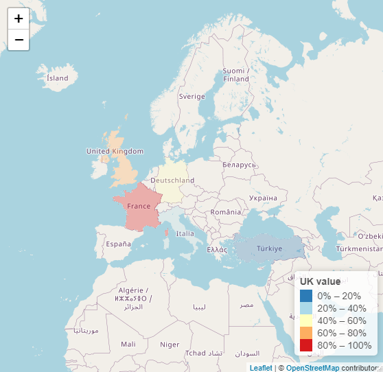

```{r load_packages, message=FALSE, warning=FALSE, include=FALSE} 
library(fontawesome)
```     


# this page is under construction

## Objectives

> This tutorial is meant to introduce [leafletjs](https://leafletjs.com/index.html)  an open-source JavaScript library
for mobile-friendly interactive maps, using a case study.


## Simple Map

### Loading Libraies 

```r
library(leaflet)
library(dplyr)
library(raster)
```


### Get Polygon Data

```r
UK <- getData("GADM", country =  "GB", level = 2)

misc = list()
misc$countries = c("GBR", "ITA", "FRA", "DEU", "TUR")
UK = do.call("bind", lapply(misc$countries, 
                                   function(x) getData('GADM', country=x, level=0)))

```


### Create Dummy Data
```r
set.seed(111)
mydf <- data.frame(place = unique(UK$NAME_0),
                   value = sample.int(n = 1000000, size = n_distinct(UK$NAME_0), replace = TRUE))
```

### Create Five Colors For Fill
```r
mypal <- colorQuantile(palette = "RdYlBu", domain = mydf$value, n = 5, reverse = TRUE)

leaflet() %>% 
  addProviderTiles("OpenStreetMap.Mapnik") %>%
 # setView(lat = 55, lng = -3, zoom = 6) %>%
  addPolygons(data = UK,
              stroke = FALSE, smoothFactor = 0.2, fillOpacity = 0.3,
              fillColor = ~mypal(mydf$value),
              popup = paste("Region: ", UK$NAME_0, "<br>",
                            "Value: ", mydf$value, "<br>")) %>%
  addLegend(position = "bottomright", pal = mypal, values = mydf$value,
            title = "UK value",
            opacity = 1)

```


<center>

{width=60%}
</center>


 <a href="#top" style="color:steelblue;" >Back to top</a> [`r fa("arrow-up", height = "2em", width = "1em", fill = "steelblue")`](#) 

