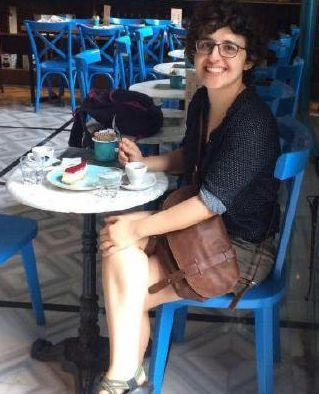

<!--\1   \1-->

```{r setup, include=FALSE}
knitr::opts_chunk$set(echo = TRUE)
```

  
```{r load_packages, message=FALSE, warning=FALSE, include=FALSE} 
library(fontawesome)
```                     


<!--\1 
<style type="text/css">
.title {
  display: none;
}


#getting-started img {
  margin-right: 10px;
}

</style>

<div class="row" style="padding-top: - 30px;">
<div class="col-sm-6">

\1-->

```{css float-right-figure-caption, echo = FALSE}
.my-right-figure {
  display: table;
  float: right;
  padding-left: 30px;
  padding-bottom: 10px;
}
.my-right-figure p {
  display: table-caption;
  caption-side: bottom;
  padding-left: 30px
}
.figure {
  display: contents;
}
.ul {
    content:attr(aria-label);
    font-size:120%;
    font-weight:bold;
    margin-left:-1px;
}
```


## **Scienziato dei Dati**

<div class="my-right-figure">
```{r echo=FALSE, fig.cap = " ", out.width='75%', fig.align='right'}

```
</div>

__Sfondo:__   

* PhD in Economia Applicata e Management (AEM) presso
<a href="https://www.unibg.it/ricerca/lavorare-ricerca/dottorati-ricerca/dottorati-ricerca/applied-economics-and-management" target="_blank">UNIBG</a> & 
<a href="https://sites.google.com/unipv.it/phd-aem/home-page/people/alumni" target="_blank">UNIPV</a>.

__Area di Interesse:__   

* Manipolazioni dei dati
* Estrai, trasforma e carica (ETL)
* Visualizzazione e mappatura interattiva dei dati
* Racconto dei dati
* Intelligenza aziendale
* Implementazione di algoritmi di apprendimento automatico
* Costruire interfacce utente interattive ([`r fa("github", fill = "purple")`](https://github.com/seymakalay))


<!--\1 
I like data manipulations, coding, web applications ([`r fa("github", fill = "purple")`](https://github.com/seymakalay)),
biking, cooking for family & friends, woodworking, and gardening the most.
\1-->


<!--\1    <u> <a href="https://github.com/seymakalay" target="_blank"> fa-github  </a> </u>,  \1-->


<!--\1
### My Tutors

During my PhD, I have been thankful to my mentors <a href="https://sites.google.com/site/danielfelixahey/home" target="_blank">Daniel Felix Ahelegbey </a> \& <a  href= "https://oric.iba.edu.pk/profile.php?id=ashrafkhan" target="_blank"> Ashraf Khan </a>
whom I learn and improve a lot as well as the head of the department 
<a href="https://didattica-rubrica.unibg.it/ugov/person/2189" target="_blank">Prof. Gianmaria Martini</a>,
and  my supervisors 
<a href="https://didattica-rubrica.unibg.it/ugov/person/2441" target="_blank">Prof. Michela Cameletti</a> \&
<a href="https://didattica-rubrica.unibg.it/ugov/person/3333" target="_blank">Prof. Federica Maria Orgio</a>.
 <!--\1 
 
 
<!--\1  Especially, I am personally thankful to  \1-->
 <!--\1 
 colleges for each of my companions and professors
 
 <a href="https://didattica-rubrica.unibg.it/ugov/person/3333" target="_blank">Prof. Federica Maria Orgio</a>. 
[UNIBG](https://www.unibg.it/ricerca/lavorare-ricerca/dottorati-ricerca/dottorati-ricerca/applied-economics-and-management) 
& [UNIPV](https://sites.google.com/unipv.it/phd-aem/home-page/people/alumni)
[applications](https://github.com/seymakalay)
[Prof. Gianmaria Martini](https://didattica-rubrica.unibg.it/ugov/person/2189),
[Prof. Michela Cameletti](https://didattica-rubrica.unibg.it/ugov/person/2441) and
[Prof. Federica Maria Orgio](https://didattica-rubrica.unibg.it/ugov/person/3333).


1. Determinants of Access to Finance: A Bibliometric Literature Review. 
2. Access to Credit: The Self-Employment Case in the Chinese Labor Market.
3. Predicting Financial Health of the Households Using Machine Learning Algorithms.
\1-->


<!--\1
### My Research Interest

During my research, I
have gained solid practical experience in data manipulation, analysis, visualization, mapping, implementing machine
learning (both supervised & unsupervised) algorithms, and building interactive user-faces. 

__First Year:__  I conducted an empirical study based on anti money laundering, implementing machine learning
using a bank data set and I created  <a href="https://seymakalay87.shinyapps.io/Mapapp/" target="_blank">mappapp</a>.

__Second Year:__ I conducted an empirical study based on credit risk, using CHFS data set.

__Third Year:__ I focused on my PhD dissertation. 

The name of the chapters of my dissertation as follows,

1. Determinants of Access to Credit: A Bibliometric Literature Review 
(<a href="https://seymakalay87.shinyapps.io/biblio/" target="_blank"> biblio </a>). 
2. Access to Credit: Using Machine Learning Algorithms 
(<a href = "https://cran.r-project.org/web/packages/pomodoro/pomodoro.pdf" target="_blank"> pomodoro </a> \&
<a href = "https://cran.r-project.org/web/packages/pepe/pepe.pdf" target="_blank"> pepe </a>).
3. Predicting Financial Health and Mapping: Using Machine Learning Algorithms 
(<a href="https://github.com/seymakalay/tp3" target="_blank"> tp3^[runs only from console] </a>).

Check out my <u><a href="./Kalay_PHD_Presantation.pdf" target="_blank"> Phd-Dissertation </a></u>  presentation.

__Fourth Year:__ I developed and published two __CRAN PACKAGES__, namely: 
**<a href="https://github.com/seymakalay/pomodoro" target="_blank"> pomodoro </a>** for machine learning
and **<a href="https://github.com/seymakalay/pepe" target="_blank"> pepe </a>** for data visualization. 


\1-->


---

Questa pagina web è stata creata con [`r fa("r-project", fill = "steelblue")`](https://www.rstudio.com),
ospitato da [`r fa("github", fill = "purple")`](https://docs.github.com/en/github/working-with-github-pages/about-github-pages), e ultimo compilato 2024-06-30.
<!--\1  `r Sys.Date()`. \1-->


<!--\1 
This web page was built with [RStudio](https://www.rstudio.com), hosted by [Github](https://docs.github.com/en/github/working-with-github-pages/about-github-pages), and last compiled `r Sys.Date()`.
#### `r fa("github", fill = "steelblue")` H4 Heading      
[`r fa("r-project", fill = "steelblue")`](https://www.rstudio.com)
\1-->


<!--\1 
fork the repo for this website and follow instructions on read me to get set up. [https://github.com/CrumpLab/LabJournalWebsite](https://github.com/CrumpLab/LabJournalWebsite)
2. Blog/journal what you are doing in R, by editing the Journal.Rmd. See the [Journal page](https://crumplab.github.io/LabJournalWebsite/Journal.html) for an example of what to do to get started learning R.
3. See the [links page](https://crumplab.github.io/LabJournalWebsite/Links.html) for lots of helpful links on learning R.
\1-->


<!--\1   
</div>
<div class="col-sm-6">

\1-->
<!--\1 
### [Crump Lab: Human Cognition and Performance](https://crumplab.github.io) 
<a href = "https://crumplab.github.io">
\1-->

<!--\1  
 
\1-->

<!--\1  ^[This web page was built with [RStudio](https://www.rstudio.com) and hosted by [github](https://docs.github.com/en/github/working-with-github-pages/about-github-pages).] </a> \1-->


<!--\1  
</div>
\1-->