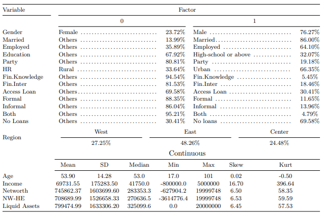

```{r, include = FALSE}
knitr::opts_chunk$set(
  collapse = TRUE,
  comment = "#>"
)
```

```{r load_packages, message=FALSE, warning=FALSE, include=FALSE} 
library(fontawesome)
```     


<!--\1  <span style="color:red">pomodoro</span> \1-->
<!--\1   \1-->
  
## Objectives

> This tutorial is meant to introduce [pepe](https://github.com/seymakalay/pepe)  package only, using a case study.
The purpose of this package is presanting the tables and plots with ease. 


### Dataset

After cleaning the data set (`sample_data`) for this case study,
we can visualize the summary statistics of the given data.


<center>
{width=85%}

</center>

Note: HR stands for Household Registration. NW-HE is net-worth minus home equity. All the asset variables (e.g.
income, net-worth, NW-HE, and liquid assets are in Chinese renminbi (CNY).


## Overview

Package `pepe` runs `Plot.by.Factr`, `df4.Plot.by.Factr`,  and `Pvot.by.Factr`.  <!--\1  `Stats.by.Factr`, \1-->
This package is useful when you need to do descriptive stats and plotting for different data splits.


### Installation

You can install `pepe` from [CRAN](https://CRAN.R-project.org) with:

``` {r install}
#install.packages("pepe")
library(pepe)
```

## Building plots

### Plotting 

`Plot.by.Factr` function will create plotting by two level factor variables (`var`).

```{r plot ,  fig.width= 10, echo=TRUE}
df <- sample_data[c("Formal","Informal","L.Both","No.Loan",
"sex","educ","political.afl","married",
 "havejob","rural","age","Income","Networth","Liquid.Assets",
 "NW.HE","fin.knowldge","fin.intermdiaries")]
 CN = colnames(df)
 var <- c("educ","rural","sex","havejob","political.afl")
 name.levels = c("Formal","Informal","L.Both","No.Loan",
 "sex","educ","political.afl","married",
 "havejob","rural","age","Income","Networth","Liquid.Assets",
 "NW.HE","fin.knowldge","fin.intermdiaries")

XXX <- df4.Plot.by.Factr(var,df)$Summ.Stats.long
Plot.by.Factr(XXX, name.levels)

```

## Building tables

### Summary statistics
`df4.Plot.by.Factr` function will create group stats.

```{r df4plot, echo=TRUE}
df4.Plot.by.Factr(var,df)

```

<!--\1  
`Stats.by.Factr` function will create group stats.

```{r statsfactr, echo=TRUE}
 Stats.by.Factr(var, df)
```
 \1-->

### Percantage table

`Pvot.by.Factr` function will create a percentage table of the selected factor variables.

```{r pvotfactr, echo=TRUE}
df <- sample_data[c("multi.level",
"Formal","L.Both","No.Loan",
 "region", "sex", "educ", "political.afl",
 "married", "havejob", "rural",
 "fin.knowldge", "fin.intermdiaries")]
 Pvot.by.Factr(df)
```


> Have Fun!


<!--\1  \( \LaTeX \)  Back to top [`r fa("arrow-up", height = "2em", width = "2em", fill = "steelblue")`](#) \1-->
 <a href="#top" style="color:steelblue;" >Back to top</a> [`r fa("arrow-up", height = "2em", width = "1em", fill = "steelblue")`](#) 


