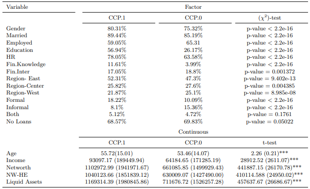

```{r load_packages, message=FALSE, warning=FALSE, include=FALSE} 
library(fontawesome)
```     

```{css bullet-margin, echo = FALSE}

li {
    content:attr(aria-label);
    font-size:100%;
    margin-right:-10px;
}

``` 


<!--\1  <span style="color:red">pomodoro</span> \1-->
<!--\1   \1-->
  
## Obiettivi

> Questo tutorial ha lo scopo di introdurre solo il pacchetto [pomodoro](https://github.com/seymakalay/pomodoro), utilizzando un case study.
Lo scopo di questo pacchetto è modellare e riportare facilmente la modellazione predittiva.


### Dataset


Dopo aver pulito il set di dati per questo caso di studio,
possiamo visualizzare le statistiche riassuntive dei dati forniti.

<center>
{width=85%}
</center>

Nota: HR sta per Household Registration. NW-HE è il patrimonio netto meno il patrimonio immobiliare. Tutte le variabili dell'asset (ad es.
reddito, patrimonio netto, NW-HE e attività liquide sono in renminbi cinese (CNY).


## Overview

Il pacchetto `pomodoro` esegue attualmente bagging (`BAG_Model`), boosting (`GBM_Model`), random forest (`RF_Model`),
modelli logistici multinominali (`MLM_Model`) e logistici (`GLM_Model`).
Questo pacchetto è utile quando è necessario confrontare la modellazione predittiva utilizzando
le diverse suddivisioni dei dati o/e l'aggiunta di variabili esogene nell'equazione.
E divide il set di dati in set di treno/test 80/20,
utilizzando un campionamento casuale stratificato e implementa 10 convalide incrociate per ciascun modello.


### Installation

Puoi installare `pomodoro` da [CRAN](https://CRAN.R-project.org) con:

``` r
install.packages("pomodoro")
library(pomodoro)
```


## Building a Selected Model

Costruiamo `RF_Model` uno dei modelli disponibili per questo pacchetto.
Nel `pomodoro` [campo aiuto](https://cran.r-project.org/web/packages/pomodoro/pomodoro.pdf)
possiamo vedere che `RF_Model` è stato definito come `RF_Model(Data, xvar, yvar)`.

### DataSet 

Per scopi computazionali prendiamo le prime 1000 righe di `sample_data`.

```r
sample_data <- sample_data[c(1:1000),]
```

### Selecting Dependent Variables

dove `xvar` è un vettore definito come di seguito:

``` r
xvar <- c("sex", "married", "age", "havejob", "educ", "political.afl",
 "rural", "region", "fin.intermdiaries", "fin.knowldge", "income")
``` 

### Selecting Independent Variables

dove "yvar" è una variabile fattore a due o più livelli definita come di seguito:

``` r
yvar <- c("Loan.Type") 
```
o

``` r
yvar <- c("multi.level")
```


### Implemantation 

Possiamo implementare `RF_Model` per `yvar <- c("multi.level")` come segue,

``` r
 yvar <- c("multi.level")
 xvar <- c("sex", "married", "age", "havejob", "educ", "political.afl",
 "rural", "region", "fin.intermdiaries", "fin.knowldge", "income")
 set.seed(123) # set.seed() for the reproducible outcome.
 BchMk.RF <- RF_Model(sample_data, xvar, yvar)
```

### Results of the `RF_Model`

Usando `attributes(BchMk.RF)`, possiamo vedere le opzioni di risultato.

`BchMk.RF$results`
```r
  mtry  Accuracy     Kappa AccuracySD    KappaSD
1    2 0.7640207 0.1712487 0.01929120 0.06294866
2    6 0.7288629 0.1729132 0.06145650 0.15118984
3   11 0.7264250 0.1782029 0.03964603 0.11603731
```


`head(BchMk.RF$Pred_prob)`
```r
    zero   one
1  0.912 0.088
3  0.968 0.032
4  0.520 0.480
12 0.898 0.102
24 0.922 0.078
33 0.956 0.044
```

`BchMk.RF$Roc`
```r
Call:
multiclass.roc.default(response = Y.test, predictor = Pred.prob)

Data: multivariate predictor Pred.prob with 2 levels of Y.test: zero, one.
Multi-class area under the curve: 0.7143
```

`BchMk.RF$ConfMat`
```r
      Y.test
       zero one
  zero  140  43
  one     8   8
```

`BchMk.RF$ACC`
```r
[1] 0.7437186
```


## Building an Estimated Models

Per modellare tutto il set di dati e le sue suddivisioni, in modo intercambiabile con
3 asset che possiedono variabili (`networth, networth_homequity e liquid.assets`)
e data una variabile esogena, in questo caso `exog = "political.afl"`.

Costruiamo di nuovo `RF_Model` ma questa volta .
Nel `pomodoro` [campo aiuto](https://cran.r-project.org/web/packages/pomodoro/pomodoro.pdf)
possiamo vedere che `Estimate_Models` è stato definito come
`Estimate_Models(DataSet = Data, yvar, exog = NULL, xvec = xvar, xadd, type, dnames)`.

Abbiamo già definito `xvar`, `yvar` e `Data`.


### Selecting `exog` Variable

`exog = "political.afl"` definirà il set di dati in base ai livelli dei fattori di
`"political.afl"` in questo caso "0" e "1".

<center>
{width=85%}

Nota: HR sta per Household Registration. NW-HE è il patrimonio netto meno il patrimonio immobiliare. Tutte le variabili dell'asset (ad es.
reddito, patrimonio netto, NW-HE e attività liquide sono in renminbi cinese (CNY).

</center>


### Selecting `xadd` Variable

`xadd` è un insieme di vettori che non sono altamente correlati con `"reddito"` ma altamente correlati tra loro.
Quindi dobbiamo aggiungere ogni variabile in `xadd = c("networth", "networth_homequity", "liquid.assets")` in modo intercambiabile.


### Selecting `type` Variable

`type` può essere uno dei modelli di bagging (`BAG`), boosting (`GBM`), random forest (`RF`), 
multinominal logistic (`MLM`), and logistic models (`GLM`). 


### Selecting `dnames` Variable

`dnames` è il valore dei fattori di `exog`. Ad esempio `dnames = c("0","1")` poiché ci sono
2 livelli in `exog = "political.afl"` che è "0" e "1".
L'argomento `dnames` è importante per evitare confusione quando si stampano i risultati.

### Implemantation 

Possiamo implementare `Estimate_Models` per `yvar <- c("multi.level")` come segue,

``` r
CCP.RF <- Estimate_Models(sample_data, yvar, xvec = xvar, exog = "political.afl",
 xadd = c("networth", "networth_homequity", "liquid.assets") ,
 type = "RF", dnames = c("0","1"))
``` 


### Results of the `Estimate_Models`
Usando `CCP.RF`, possiamo vedere i risultati di
`BchMk+networth`, `BchMk+networth_homequity`, `BchMk+liquid.assets`
`D.0+patrimonio netto`, `D.0+equità_patrimoniale_patrimoniale`, `D.0+asset.liquidi`,
"D.1+patrimonio netto", "D.1+patrimonio_patrimoniale_patrimoniale" e "D.1+attivo.liquido".

`Estimate_Models` ha implementato `RF_Model`, in primo luogo per tutti i set di dati come viene chiamato `BchMk`,
in secondo luogo `D.0` e infine `D.1`, aggiungendo 3 variabili di asset in modo intercambiabile.

Dove `D.0` e `D.1` derivano da `dnames = c("0","1")` e
può essere interpretato come `D.0` quando `political.afl == 0` e `D.1` quando `political.afl == 1`

`Estimate_Models` ha riportato `BchMk` con tutte le variabili `exog` e
diviso tutto il set di dati (`BchMk`) a 2 livelli, quando l'osservazione ha
`political.afl == 0` o `political.afl == 1`,


Poiché si tratta di un oggetto elenco, dobbiamo utilizzare `attributi` come segue,

```r
attributes(CCP.RF$EstMdl$`D.1+liquid.assets`)
```

```r
> CCP.RF$EstMdl$`D.1+liquid.assets`$results
  mtry  Accuracy     Kappa AccuracySD   KappaSD
1    2 0.7926901 0.3348631 0.04543311 0.1835925
2    6 0.7929825 0.3707344 0.03656725 0.1258099
3   11 0.7979532 0.3894589 0.03274767 0.1245565
```


```r
> head(CCP.RF$EstMdl$`D.1+liquid.assets`$Pred_prob)
    zero   one
3  0.992 0.008
4  0.124 0.876
8  0.290 0.710
25 0.742 0.258
33 0.854 0.146
36 0.750 0.250
```


```r
> CCP.RF$EstMdl$`D.1+liquid.assets`$Roc

Call:
multiclass.roc.default(response = Y.test, predictor = Pred.prob)

Data: multivariate predictor Pred.prob with 2 levels of Y.test: zero, one.
Multi-class area under the curve: 0.8182
```


```r
> CCP.RF$EstMdl$`D.1+liquid.assets`$ConfMat
      Y.test
       zero one
  zero   29   4
  one     5   7
```


```r
> CCP.RF$EstMdl$`D.1+liquid.assets`$ACC
[1] 0.8
```


## Building a Combined Performance

`Estimate_Models` ha riportato risultati predittivi sia per `political.afl == 0` che per `political.afl == 1`.
Ciò di cui abbiamo bisogno è combinare questi set di dati divisi per calcolare su tutte le prestazioni per il
divisione dei dati sull'affiliazione politica.


Nel `pomodoro` [campo aiuto](https://cran.r-project.org/web/packages/pomodoro/pomodoro.pdf)
possiamo vedere che `Combined_Performance` è stato definito come
`Combined_Performance(Sub.Est.Mdls)`.

Abbiamo già definito tutto ciò di cui abbiamo bisogno in `Estimate_Models`, riuniamoli.

### Implemantation 

``` r
Sub.CCP.RF <- list(Mdl.1 = CCP.RF$EstMdl$`D.1+networth`,
Mdl.0 = CCP.RF$EstMdl$`D.0+networth`)
CCP.NoCCP.RF <- Combined_Performance(Sub.CCP.RF)
``` 

### Results of the `Combined_Performance`

Usando `attributes(CCP.NoCCP.RF)` possiamo vedere i risultati di `Combined_Performance`


`head(CCP.NoCCP.RF$Pred_prob)`
```r
    zero   one
58 0.120 0.880
60 0.822 0.178
61 0.116 0.884
75 0.980 0.020
80 0.402 0.598
85 0.950 0.050
```

`CCP.NoCCP.RF$Roc`
```r
Call:
multiclass.roc.default(response = Combine.Mdl$Actual, predictor = Pred_prob)

Data: multivariate predictor Pred_prob with 2 levels of Combine.Mdl$Actual: zero, one.
Multi-class area under the curve: 0.6929
```

`CCP.NoCCP.RF$ConfMat`
```r
      one zero
  one   11    4
  zero  39  143
```

`CCP.NoCCP.RF$ACC`
```r
> CCP.RF$EstMdl$`D.1+liquid.assets`$ACC
[1] 0.7817259
```


> Divertiti!


<!--\1  \( \LaTeX \)  Back to top [`r fa("arrow-up", height = "2em", width = "2em", fill = "steelblue")`](#) \1-->
 <a href="#top" style="color:steelblue;" >Back to top</a> [`r fa("arrow-up", height = "2em", width = "1em", fill = "steelblue")`](#) 


