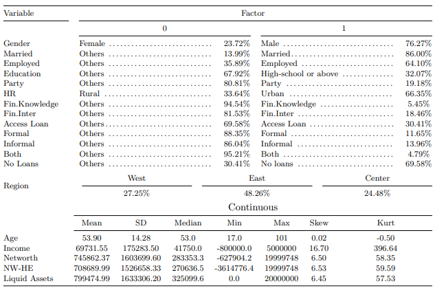

```{r load_packages, message=FALSE, warning=FALSE, include=FALSE} 
library(fontawesome)
```     

<!--\1  <span style="color:red">pomodoro</span> \1-->
<!--\1   \1-->
  
## Objectives

> This tutorial is meant to introduce [pomodoro](https://github.com/seymakalay/pomodoro)  package only, using a case study.
The purpose of this package is modelling and reporting the predictive modelling with ease. 


### Dataset

After cleaning the data set for this case study, 
we can visualize the summary statistics of the given data.


<center>
{width=85%}
</center>

Note: HR stands for Household Registration. NW-HE is net-worth minus home equity. All the asset variables (e.g.
income, net-worth, NW-HE, and liquid assets are in Chinese renminbi (CNY).


## Overview

Package `pomodoro` runs currently bagging (`BAG_Model`), boosting (`GBM_Model`), random forest (`RF_Model`), 
multinominal logistic (`MLM_Model`), and logistic models (`GLM_Model`).
This package is useful when you need the compare the predictive modeling using 
the different data splits or/and adding exogenous variables into the equation.
And it divides the data set  into 80/20 train/test set, 
using stratified random sampling and implements 10 cross validation to each model.


### Installation

You can install `pomodoro` from [CRAN](https://CRAN.R-project.org) with:

``` r
install.packages("pomodoro")
library(pomodoro)
```


## Building a Selected Model

Let's build `RF_Model` one of the models which is available for this package.
In the `pomodoro` [help field](https://cran.r-project.org/web/packages/pomodoro/pomodoro.pdf)
we can see that `RF_Model`  was defined as  `RF_Model(Data, xvar, yvar)`.

### DataSet 

For the computational purposes lets take the first 1000 rows of the `sample_data`.

```r
sample_data <- sample_data[c(1:1000),]
```

### Selecting Dependent Variables

where `xvar` is a vector which is defined as below:  

``` r
xvar <- c("sex", "married", "age", "havejob", "educ", "political.afl",
 "rural", "region", "fin.intermdiaries", "fin.knowldge", "income")
``` 

### Selecting Independent Variables

where `yvar` is a two or multilevel factor variable which  is defined as below: 


``` r
yvar <- c("Loan.Type") 
```
or
``` r
yvar <- c("multi.level")
```


### Implemantation 

We can implement `RF_Model` for `yvar <- c("multi.level")` as follows,

``` r
 yvar <- c("multi.level")
 xvar <- c("sex", "married", "age", "havejob", "educ", "political.afl",
 "rural", "region", "fin.intermdiaries", "fin.knowldge", "income")
 set.seed(123) # set.seed() for the reproducible outcome.
 BchMk.RF <- RF_Model(sample_data, xvar, yvar)
```

### Results of the `RF_Model`

Using `attributes(BchMk.RF)`, we can see the outcome options.

`BchMk.RF$results`
```r
  mtry  Accuracy     Kappa AccuracySD    KappaSD
1    2 0.7640207 0.1712487 0.01929120 0.06294866
2    6 0.7288629 0.1729132 0.06145650 0.15118984
3   11 0.7264250 0.1782029 0.03964603 0.11603731
```


`head(BchMk.RF$Pred_prob)`
```r
    zero   one
1  0.912 0.088
3  0.968 0.032
4  0.520 0.480
12 0.898 0.102
24 0.922 0.078
33 0.956 0.044
```

`BchMk.RF$Roc`
```r
Call:
multiclass.roc.default(response = Y.test, predictor = Pred.prob)

Data: multivariate predictor Pred.prob with 2 levels of Y.test: zero, one.
Multi-class area under the curve: 0.7143
```

`BchMk.RF$ConfMat`
```r
      Y.test
       zero one
  zero  140  43
  one     8   8
```

`BchMk.RF$ACC`
```r
[1] 0.7437186
```


## Building an Estimated Models

To model all the data set and its splits, interchangeably with 
3 assets owning variables (`networth, networth_homequity, and liquid.assets`)
and given an exogenous variable, in this case `exog = "political.afl"`.

Let's build `RF_Model` again but this time .
In the `pomodoro` [help field](https://cran.r-project.org/web/packages/pomodoro/pomodoro.pdf)
we can see that `Estimate_Models`  was defined as
`Estimate_Models(DataSet = Data, yvar, exog = NULL, xvec = xvar, xadd, type, dnames)`.

We have already defined `xvar`, `yvar` and `Data`.


### Selecting `exog` Variable

`exog = "political.afl"` will define the data set based on the factor levels of the 
`"political.afl"` in this case "0" and "1".  

### Selecting `xadd` Variable

`xadd` is a vector set which are not highly correlated with `"income"` but highly correlated between them.
So we need to add each variable in `xadd = c("networth", "networth_homequity", "liquid.assets")` interchangeably. 


### Selecting `type` Variable

`type` can be on of the bagging (`BAG`), boosting (`GBM`), random forest (`RF`), 
multinominal logistic (`MLM`), and logistic models (`GLM`). 


### Selecting `dnames` Variable

`dnames` is the factor values of `exog`. For example `dnames = c("0","1")` since there are 
2 levels in `exog = "political.afl"` which is "0" and "1".
`dnames` argument is important to avoid confusion when we print out the results.


### Implemantation 

We can implement `Estimate_Models` for `yvar <- c("multi.level")` as follows,

``` r
CCP.RF <- Estimate_Models(sample_data, yvar, xvec = xvar, exog = "political.afl",
 xadd = c("networth", "networth_homequity", "liquid.assets") ,
 type = "RF", dnames = c("0","1"))
``` 


### Results of the `Estimate_Models`

Using `CCP.RF`, we can see the outcomes of 
`BchMk+networth`, `BchMk+networth_homequity`, `BchMk+liquid.assets`
`D.0+networth`, `D.0+networth_homequity`, `D.0+liquid.assets`,
`D.1+networth`, `D.1+networth_homequity`, and `D.1+liquid.assets`. 

`Estimate_Models` implemented `RF_Model`, firstly to all data set as it is called `BchMk`,
secondly `D.0` and lastly `D.1`, adding 3 asset variables interchangeably.  

Where `D.0` and `D.1` are coming from the `dnames = c("0","1")` and
can be interpreted as `D.0` when  `political.afl == 0` and  `D.1` when `political.afl == 1`

`Estimate_Models` reported  `BchMk` with all the `exog` variables and 
divided all the data set (`BchMk`) in to 2-level, when the observation has 
`political.afl == 0` or `political.afl == 1`,


Since this is a list object we need to use `attributes` as follows,

```r
attributes(CCP.RF$EstMdl$`D.1+liquid.assets`)
```

```r
> CCP.RF$EstMdl$`D.1+liquid.assets`$results
  mtry  Accuracy     Kappa AccuracySD   KappaSD
1    2 0.7926901 0.3348631 0.04543311 0.1835925
2    6 0.7929825 0.3707344 0.03656725 0.1258099
3   11 0.7979532 0.3894589 0.03274767 0.1245565
```


```r
> head(CCP.RF$EstMdl$`D.1+liquid.assets`$Pred_prob)
    zero   one
3  0.992 0.008
4  0.124 0.876
8  0.290 0.710
25 0.742 0.258
33 0.854 0.146
36 0.750 0.250
```


```r
> CCP.RF$EstMdl$`D.1+liquid.assets`$Roc

Call:
multiclass.roc.default(response = Y.test, predictor = Pred.prob)

Data: multivariate predictor Pred.prob with 2 levels of Y.test: zero, one.
Multi-class area under the curve: 0.8182
```


```r
> CCP.RF$EstMdl$`D.1+liquid.assets`$ConfMat
      Y.test
       zero one
  zero   29   4
  one     5   7
```


```r
> CCP.RF$EstMdl$`D.1+liquid.assets`$ACC
[1] 0.8
```


## Building a Combined Performance

`Estimate_Models` reported predictive results for both `political.afl == 0` and `political.afl == 1`.
What we need is to combine these split data set to calculate over all the performance for the
political affiliation data split.


In the `pomodoro` [help field](https://cran.r-project.org/web/packages/pomodoro/pomodoro.pdf)
we can see that `Combined_Performance`  was defined as
`Combined_Performance(Sub.Est.Mdls)`.

We have already defined all we need in `Estimate_Models` let`s bring them together.

### Implemantation 

``` r
Sub.CCP.RF <- list(Mdl.1 = CCP.RF$EstMdl$`D.1+networth`,
Mdl.0 = CCP.RF$EstMdl$`D.0+networth`)
CCP.NoCCP.RF <- Combined_Performance(Sub.CCP.RF)
``` 

### Results of the `Combined_Performance`

Using  `attributes(CCP.NoCCP.RF)` we can see the outcomes of `Combined_Performance`


`head(CCP.NoCCP.RF$Pred_prob)`
```r
    zero   one
58 0.120 0.880
60 0.822 0.178
61 0.116 0.884
75 0.980 0.020
80 0.402 0.598
85 0.950 0.050
```

`CCP.NoCCP.RF$Roc`
```r
Call:
multiclass.roc.default(response = Combine.Mdl$Actual, predictor = Pred_prob)

Data: multivariate predictor Pred_prob with 2 levels of Combine.Mdl$Actual: zero, one.
Multi-class area under the curve: 0.6929
```

`CCP.NoCCP.RF$ConfMat`
```r
      one zero
  one   11    4
  zero  39  143
```

`CCP.NoCCP.RF$ACC`
```r
> CCP.RF$EstMdl$`D.1+liquid.assets`$ACC
[1] 0.7817259
```


> Have Fun!


<!--\1  \( \LaTeX \)  Back to top [`r fa("arrow-up", height = "2em", width = "2em", fill = "steelblue")`](#) \1-->
 <a href="#top" style="color:steelblue;" >Back to top</a> [`r fa("arrow-up", height = "2em", width = "1em", fill = "steelblue")`](#) 


