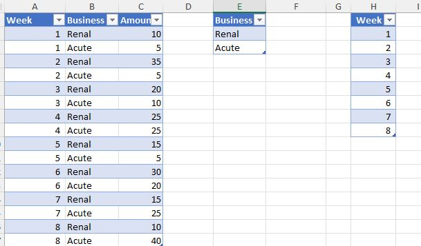
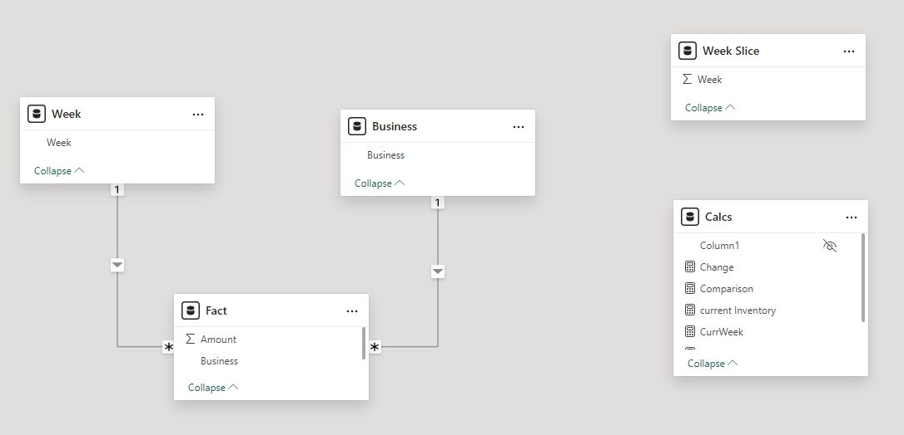
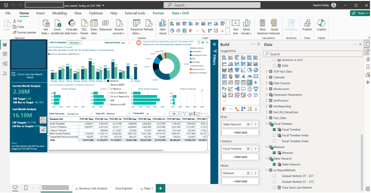
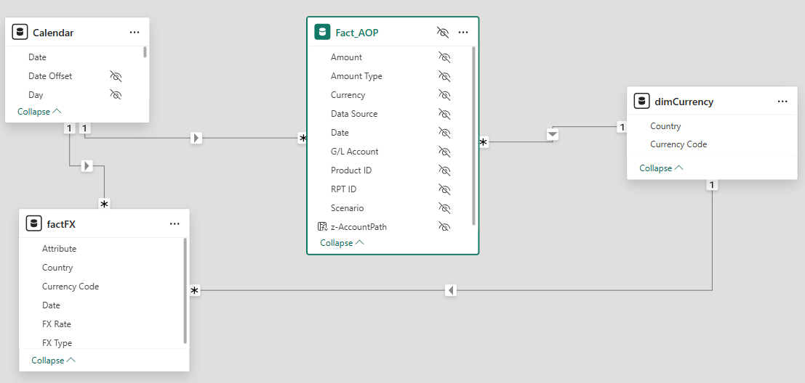

```{r setup, include=FALSE}
knitr::opts_chunk$set(echo = TRUE)
```


```{r load_packages, message=FALSE, warning=FALSE, include=FALSE} 
library(fontawesome)
library(knitr)
library(kableExtra)
library(dplyr)
library(xtable)
```     

<!--\1  <span style="color:red">pomodoro</span> \1-->
<!--\1   \1-->

> This page is under construction. 

> This tutorial provides a guideline for fundamental concepts in PowerBI.
 
<!--\1  > In this page, I will show the Must Have for a Power BI report.1-->


## DimCalendar

Date Dimension is useful for scenarios mentioned below;

<body>
    <ul>
      <li>Ability to slice and dice by many date attributes (such as week number, half year, day of year, and etc.).</li>
      <li>Helps to calculate 'Time Intelligence' functions (MTD, QTD, YTD,..etc.).</li>
      <li>Consistency in Analysis.</li>
    </ul>
</body>


Let\'s create the `dimCalendar` data flow where the Fiscal year starts in May.
```
let
  YearStart = 2020,
  Source = List.Dates(#date(YearStart,1,1),365*8,#duration(1, 0, 0, 0)),
  #"Converted to table" = Table.FromList(Source, Splitter.SplitByNothing(), null, null, ExtraValues.Error),
  #"Renamed columns" = Table.RenameColumns(#"Converted to table", {{"Column1", "Date"}}),
  #"Changed column type" = Table.TransformColumnTypes(#"Renamed columns", {{"Date", type date}}),
    // sample comment
    #"Add Fiscal Year Start" = Table.AddColumn(#"Changed column type", "Fiscal Year Start", each if [Date] > Date.AddDays(#date(Date.Year([Date]),4,30), Date.DayOfWeek(#date(Date.Year([Date]),4,30),5)*-1) then
        Date.AddDays(#date(Date.Year([Date]),4,30), Date.DayOfWeek(#date(Date.Year([Date]),4,30),5)*-1+1) else
        Date.AddDays(#date(Date.Year([Date])-1,4,30), Date.DayOfWeek(#date(Date.Year([Date])-1,4,30),5)*-1+1), type date),
    ref_FiscalStartCalendar = List.Min(#"Add Fiscal Year Start"[Fiscal Year Start]),
    #"Add Fiscal Year End" = Table.AddColumn(#"Add Fiscal Year Start", "Fiscal Year End", each if [Date] > Date.AddDays(#date(Date.Year([Date]),4,30), Date.DayOfWeek(#date(Date.Year([Date]),4,30),5)*-1) then
        Date.AddDays(#date(Date.Year([Date])+1,4,30), Date.DayOfWeek(#date(Date.Year([Date])+1,4,30),5)*-1) else
        Date.AddDays(#date(Date.Year([Date]),4,30), Date.DayOfWeek(#date(Date.Year([Date]),4,30),5)*-1), type date),
    #"Add FIscal Year" = Table.AddColumn(#"Add Fiscal Year End", "Fiscal Year", each Text.Combine({"FY", Text.Range(Text.From(Date.Year([Fiscal Year End])),2,2)}), type text),
    #"Add Fiscal Weeks" = Table.AddColumn(#"Add FIscal Year", "Fiscal Weeks", each (Duration.Days([Fiscal Year End]-[Fiscal Year Start])+1)/7, Int64.Type),
    #"Add Fiscal Month 01 End 4/5" = Table.AddColumn(#"Add Fiscal Weeks", "Fiscal Month 01 End", each if [Fiscal Weeks]=53 then Date.AddDays([Fiscal Year Start],35-1) else Date.AddDays([Fiscal Year Start],28-1), type date),
    #"Add Fiscal Month 02 End 5" = Table.AddColumn(#"Add Fiscal Month 01 End 4/5", "Fiscal Month 02 End", each Date.AddDays([Fiscal Month 01 End],35), type date),
    #"Add Fiscal Month 03 End 4" = Table.AddColumn(#"Add Fiscal Month 02 End 5", "Fiscal Month 03 End", each Date.AddDays([Fiscal Month 02 End],28), type date),
    #"Add Fiscal Month 04 End 4" = Table.AddColumn(#"Add Fiscal Month 03 End 4", "Fiscal Month 04 End", each Date.AddDays([Fiscal Month 03 End],28), type date),
    #"Add Fiscal Month 05 End 5" = Table.AddColumn(#"Add Fiscal Month 04 End 4", "Fiscal Month 05 End", each Date.AddDays([Fiscal Month 04 End],35), type date),
    #"Add Fiscal Month 06 End 4" = Table.AddColumn(#"Add Fiscal Month 05 End 5", "Fiscal Month 06 End", each Date.AddDays([Fiscal Month 05 End],28), type date),
    #"Add Fiscal Month 07 End 4" = Table.AddColumn(#"Add Fiscal Month 06 End 4", "Fiscal Month 07 End", each Date.AddDays([Fiscal Month 06 End],28), type date),
    #"Add Fiscal Month 08 End 5" = Table.AddColumn(#"Add Fiscal Month 07 End 4", "Fiscal Month 08 End", each Date.AddDays([Fiscal Month 07 End],35), type date),
    #"Add Fiscal Month 09 End 4" = Table.AddColumn(#"Add Fiscal Month 08 End 5", "Fiscal Month 09 End", each Date.AddDays([Fiscal Month 08 End],28), type date),
    #"Add Fiscal Month 10 End 4" = Table.AddColumn(#"Add Fiscal Month 09 End 4", "Fiscal Month 10 End", each Date.AddDays([Fiscal Month 09 End],28), type date),
    #"Add Fiscal Month 11 End 5" = Table.AddColumn(#"Add Fiscal Month 10 End 4", "Fiscal Month 11 End", each Date.AddDays([Fiscal Month 10 End],35), type date),
    #"Add Fiscal Month 12 End 4" = Table.AddColumn(#"Add Fiscal Month 11 End 5", "Fiscal Month 12 End", each Date.AddDays([Fiscal Month 11 End],28), type date),
    #"Add Fiscal Period Num" = Table.AddColumn(#"Add Fiscal Month 12 End 4", "Fiscal Month", each if
[Date] <= [Fiscal Month 01 End] then 1 else if
[Date] <= [Fiscal Month 02 End] then 2 else if
[Date] <= [Fiscal Month 03 End] then 3 else if
[Date] <= [Fiscal Month 04 End] then 4 else if
[Date] <= [Fiscal Month 05 End] then 5 else if
[Date] <= [Fiscal Month 06 End] then 6 else if
[Date] <= [Fiscal Month 07 End] then 7 else if
[Date] <= [Fiscal Month 08 End] then 8 else if
[Date] <= [Fiscal Month 09 End] then 9 else if
[Date] <= [Fiscal Month 10 End] then 10 else if
[Date] <= [Fiscal Month 11 End] then 11 else if
[Date] <= [Fiscal Month 12 End] then 12


else null, Int64.Type),
    #"Add FY" = Table.AddColumn(#"Add Fiscal Period Num", "FY", each Date.Year([Fiscal Year End]), Int64.Type),
    #"Add Day Name" = Table.AddColumn(#"Add FY", "Day Name", each Date.DayOfWeekName([Date]), type text),
    #"Add Day" = Table.AddColumn(#"Add Day Name", "Day", each Date.Day([Date]), Int64.Type),
    #"Add Days in Month" = Table.AddColumn(#"Add Day", "Days in month", each Date.DaysInMonth([Date]), Int64.Type),
    #"Add End of Month" = Table.AddColumn(#"Add Days in Month", "End of month", each Date.EndOfMonth([Date]), type date),
    #"Add Month" = Table.AddColumn(#"Add End of Month", "Month", each Date.Month([Date]), Int64.Type),
    #"Add Fiscal Quarter Num" = Table.AddColumn(#"Add Month", "Fiscal Quarter Number", each if [Fiscal Month] <= 3 then 1 else if [Fiscal Month] <= 6 then 2 else if [Fiscal Month] <= 9 then 3 else if [Fiscal Month] <= 12 then 4 else 999, Int64.Type),
    #"Add Fiscal Quarter" = Table.AddColumn(#"Add Fiscal Quarter Num", "Fiscal Quarter", each Text.Combine({"Q", Text.From([Fiscal Quarter Number])}), type text),
    #"Add Fiscal Quarter-Year" = Table.AddColumn(#"Add Fiscal Quarter", "Fiscal Quarter-Year", each Text.Combine({[Fiscal Quarter],"-",[Fiscal Year]}), type text),
    #"Add Fiscal Month Name" = Table.AddColumn(#"Add Fiscal Quarter-Year", "Fiscal Month Name", each if [Fiscal Month]<=8 then Text.Start(Date.MonthName(#date([FY],[Fiscal Month]+4,15)),3) else Text.Start(Date.MonthName(#date([FY],[Fiscal Month]-8,15)),3), type text),
    #"Add Fiscal Month-Year" = Table.AddColumn(#"Add Fiscal Month Name", "Fiscal Month-Year", each Text.Combine({[Fiscal Month Name], [Fiscal Year]}, "-"), type text),
    #"Add Fiscal Year-Month num" = Table.AddColumn(#"Add Fiscal Month-Year", "Fiscal Year-Month num", each [FY]*100+[Fiscal Month], Int64.Type),
    #"Add Fiscal Year-Quarter num" = Table.AddColumn(#"Add Fiscal Year-Month num", "Fiscal Year-Quarter num", each [FY]*100+[Fiscal Quarter Number], Int64.Type),
    #"Add Fiscal week num" = Table.AddColumn(#"Add Fiscal Year-Quarter num", "Fiscal Week num", each Number.RoundUp(Duration.Days([Date]-Date.AddDays([Fiscal Year Start],-1))/7), Int64.Type),
  AddDayOfFiscalYear = Table.AddColumn(#"Add Fiscal week num", "Day of Fiscal Year", each Duration.Days([Date] - [Fiscal Year Start]) + 1, Int64.Type),
  AddDateOffset = Table.TransformColumnTypes(Table.AddColumn(AddDayOfFiscalYear, "Date Offset", each if DateTime.Date(DateTime.FixedLocalNow()) > [Date]
then (-1) * Duration.Days(DateTime.Date(DateTime.FixedLocalNow())-[Date]) else if DateTime.Date(DateTime.FixedLocalNow()) < [Date] then
Duration.Days([Date] - DateTime.Date(DateTime.FixedLocalNow())) else 0), {{"Date Offset", Int64.Type}}),

    fiscalWeeks =
      let
        #"Removed Other Columns" = Table.SelectColumns(AddDateOffset,{"FY", "Fiscal Week num","Date"}),
        #"Grouped Rows" = Table.Group(#"Removed Other Columns", {"FY", "Fiscal Week num"}, {{"Start of Fiscal Week", each List.Min([Date]), type nullable date}, {"End of Fiscal Week", each List.Max([Date]), type nullable date}}),
        #"Sorted Rows" = Table.Sort(#"Grouped Rows",{{"FY", Order.Ascending}, {"Fiscal Week num", Order.Ascending}}),
        #"Added Index" = Table.AddIndexColumn(#"Sorted Rows", "Sequential Fiscal Week", 1, 1, Int64.Type),
        #"Added Custom" = Table.AddColumn(#"Added Index", "Fiscal Week Offset", each Table.SelectColumns(Table.LastN(Table.SelectRows(#"Added Index", each Date.IsInPreviousNDays([Start of Fiscal Week], 7)),1),"Sequential Fiscal Week" )),
        #"Expanded Fiscal Week Offset" = Table.ExpandTableColumn(#"Added Custom", "Fiscal Week Offset", {"Sequential Fiscal Week"}, {"CurrFiscWk"}),
        #"Changed Type" = Table.TransformColumnTypes(#"Expanded Fiscal Week Offset",{{"CurrFiscWk", Int64.Type}}),
        #"Added Custom1" = Table.AddColumn(#"Changed Type", "Fiscal Week Offset", each [Sequential Fiscal Week] - [CurrFiscWk], Int64.Type),
        #"Removed Columns" = Table.RemoveColumns(#"Added Custom1",{"CurrFiscWk"})
      in
        #"Removed Columns",

    ResetCal = AddDateOffset,
    #"Merged Queries" = Table.NestedJoin(ResetCal, {"FY", "Fiscal Week num"}, fiscalWeeks, {"FY", "Fiscal Week num"}, "Add_SequentialWeek", JoinKind.LeftOuter),
    #"Expanded Add_SequentialWeek" = Table.ExpandTableColumn(#"Merged Queries", "Add_SequentialWeek", {"Start of Fiscal Week", "End of Fiscal Week", "Sequential Fiscal Week", "Fiscal Week Offset"}, {"Start of Fiscal Week", "End of Fiscal Week", "Sequential Fiscal Week", "Fiscal Week Offset"}),
 

    Add_SequentialWeek = Table.AddColumn(#"Expanded Add_SequentialWeek", "Sequential Week Number", each Number.RoundUp(Duration.Days([Date]-Date.AddDays(Date.AddDays(#date(YearStart-1,4,30), Date.DayOfWeek(#date(Date.Year([Date])-1,4,30),5)*-1+1),-1))/7) - Number.RoundUp(Duration.Days(#date(YearStart,1,1)-Date.AddDays(Date.AddDays(#date(YearStart-1,4,30), Date.DayOfWeek(#date(Date.Year([Date])-1,4,30),5)*-1+1),-1))/7), Int64.Type),
    Add_StartOfWeek = Table.AddColumn(Add_SequentialWeek, "Start of Week", each Date.AddDays( Date.AddDays(#date(YearStart-1,4,30), Date.DayOfWeek(#date(Date.Year([Date])-1,4,30),5)*-1+1)
    ,(-7) + 7 * Number.RoundUp(Duration.Days([Date]-Date.AddDays(Date.AddDays(#date(YearStart-1,4,30), Date.DayOfWeek(#date(Date.Year([Date])-1,4,30),5)*-1+1),-1))/7) ), type date),
    Add_EndOfWeek = Table.AddColumn(Add_StartOfWeek, "End of Week", each Date.AddDays( Date.AddDays(#date(YearStart-1,4,30), Date.DayOfWeek(#date(Date.Year([Date])-1,4,30),5)*-1+1)
    ,(-1) + 7 * Number.RoundUp(Duration.Days([Date]-Date.AddDays(Date.AddDays(#date(YearStart-1,4,30), Date.DayOfWeek(#date(Date.Year([Date])-1,4,30),5)*-1+1),-1))/7) ), type date),

    #"Add Month name" = Table.AddColumn(Add_EndOfWeek, "Month name", each Date.MonthName([Date]), type text),
    #"Changed Type" = Table.TransformColumnTypes(#"Add Month name",{{"Date", type date}, {"Fiscal Year Start", type date}, {"Fiscal Year End", type date}, {"Fiscal Month 01 End", type date}, {"Fiscal Month 02 End", type date}, {"Fiscal Month 03 End", type date}, {"Fiscal Month 04 End", type date}, {"Fiscal Month 05 End", type date}, {"Fiscal Month 06 End", type date}, {"Fiscal Month 07 End", type date}, {"Fiscal Year", type text}, {"Fiscal Weeks", Int64.Type}, {"Fiscal Month 08 End", type date}, {"Fiscal Month 09 End", type date}, {"Fiscal Month 10 End", type date}, {"Fiscal Month 11 End", type date}, {"Fiscal Month 12 End", type date}, {"Fiscal Month", Int64.Type}, {"FY", Int64.Type}, {"Day", Int64.Type}, {"Days in month", Int64.Type}, {"Day Name", type text}, {"End of month", type date}, {"Month", Int64.Type}, {"Fiscal Quarter Number", Int64.Type}, {"Fiscal Quarter", type text}, {"Fiscal Quarter-Year", type text}, {"Fiscal Month Name", type text}, {"Fiscal Month-Year", type text}, {"Month name", type text}, {"Fiscal Year-Month num", Int64.Type}, {"Fiscal Year-Quarter num", Int64.Type}, {"Fiscal Week num", Int64.Type}}),
    // code added below is from Matt Hecht on 3/22/23. Added start/end of fiscal quarters and months, with offsets to support them
  Add_Start_Of_Fiscal_mo = Table.AddColumn(#"Changed Type", "Start of Fiscal Month", each
      if [Fiscal Month] = 1 then [Fiscal Year Start] else
      if [Fiscal Month] = 2 then Date.AddDays([Fiscal Month 01 End], 1) else
      if [Fiscal Month] = 3 then Date.AddDays([Fiscal Month 02 End], 1) else
      if [Fiscal Month] = 4 then Date.AddDays([Fiscal Month 03 End], 1) else
      if [Fiscal Month] = 5 then Date.AddDays([Fiscal Month 04 End], 1) else
      if [Fiscal Month] = 6 then Date.AddDays([Fiscal Month 05 End], 1) else
      if [Fiscal Month] = 7 then Date.AddDays([Fiscal Month 06 End], 1) else
      if [Fiscal Month] = 8 then Date.AddDays([Fiscal Month 07 End], 1) else
      if [Fiscal Month] = 9 then Date.AddDays([Fiscal Month 08 End], 1) else
      if [Fiscal Month] = 10 then Date.AddDays([Fiscal Month 09 End], 1) else
      if [Fiscal Month] = 11 then Date.AddDays([Fiscal Month 10 End], 1) else
      if [Fiscal Month] = 12 then Date.AddDays([Fiscal Month 11 End], 1) else
      null, type date ),
    Add_End_Of_Fiscal_mo = Table.AddColumn(Add_Start_Of_Fiscal_mo, "End of Fiscal Month", each
      if [Fiscal Month] = 1 then [Fiscal Month 01 End] else
      if [Fiscal Month] = 2 then [Fiscal Month 02 End] else
      if [Fiscal Month] = 3 then [Fiscal Month 03 End] else
      if [Fiscal Month] = 4 then [Fiscal Month 04 End] else
      if [Fiscal Month] = 5 then [Fiscal Month 05 End] else
      if [Fiscal Month] = 6 then [Fiscal Month 06 End] else
      if [Fiscal Month] = 7 then [Fiscal Month 07 End] else
      if [Fiscal Month] = 8 then [Fiscal Month 08 End] else
      if [Fiscal Month] = 9 then [Fiscal Month 09 End] else
      if [Fiscal Month] = 10 then [Fiscal Month 10 End] else
      if [Fiscal Month] = 11 then [Fiscal Month 11 End] else
      if [Fiscal Month] = 12 then [Fiscal Month 12 End] else
      null, type date ),
  CurrDt_Index = if List.Max( Add_Start_Of_Fiscal_mo[Date] ) > DateTime.Date(DateTime.FixedLocalNow()) then DateTime.Date(DateTime.FixedLocalNow()) else Date.AddDays( List.Max( Add_Start_Of_Fiscal_mo[Date] ), -1 ),
  CurrDt_Start_Fmo_Index = Record.Field(Table.Min(Table.Buffer(Table.SelectRows( Add_End_Of_Fiscal_mo, each [End of Fiscal Month] > CurrDt_Index ) ), "Start of Fiscal Month"), "Start of Fiscal Month"),
  Add_Fiscal_Month_Offset = Table.AddColumn(Add_End_Of_Fiscal_mo, "Fiscal Month Offset", each Number.Round(Number.From( [Start of Fiscal Month] - CurrDt_Start_Fmo_Index)/ 30,0), Int64.Type),
    Add_Start_Of_Fiscal_Qtr = Table.AddColumn(Add_Fiscal_Month_Offset, "Start of Fiscal Quarter", each
      if [Fiscal Month] = 1 then [Fiscal Year Start] else
      if [Fiscal Month] = 2 then [Fiscal Year Start] else
      if [Fiscal Month] = 3 then [Fiscal Year Start] else
      if [Fiscal Month] = 4 then Date.AddDays([Fiscal Month 03 End], 1) else
      if [Fiscal Month] = 5 then Date.AddDays([Fiscal Month 03 End], 1) else
      if [Fiscal Month] = 6 then Date.AddDays([Fiscal Month 03 End], 1) else
      if [Fiscal Month] = 7 then Date.AddDays([Fiscal Month 06 End], 1) else
      if [Fiscal Month] = 8 then Date.AddDays([Fiscal Month 06 End], 1) else
      if [Fiscal Month] = 9 then Date.AddDays([Fiscal Month 06 End], 1) else
      if [Fiscal Month] = 10 then Date.AddDays([Fiscal Month 09 End], 1) else
      if [Fiscal Month] = 11 then Date.AddDays([Fiscal Month 09 End], 1) else
      if [Fiscal Month] = 12 then Date.AddDays([Fiscal Month 09 End], 1) else
      null, type date ),
    Add_End_Of_Fiscal_Qtr = Table.AddColumn(Add_Start_Of_Fiscal_Qtr, "End of Fiscal Quarter", each
      if [Fiscal Month] = 1 then [Fiscal Month 03 End] else
      if [Fiscal Month] = 2 then [Fiscal Month 03 End] else
      if [Fiscal Month] = 3 then [Fiscal Month 03 End] else
      if [Fiscal Month] = 4 then [Fiscal Month 06 End] else
      if [Fiscal Month] = 5 then [Fiscal Month 06 End] else
      if [Fiscal Month] = 6 then [Fiscal Month 06 End] else
      if [Fiscal Month] = 7 then [Fiscal Month 09 End] else
      if [Fiscal Month] = 8 then [Fiscal Month 09 End] else
      if [Fiscal Month] = 9 then [Fiscal Month 09 End] else
      if [Fiscal Month] = 10 then [Fiscal Month 12 End] else
      if [Fiscal Month] = 11 then [Fiscal Month 12 End] else
      if [Fiscal Month] = 12 then [Fiscal Month 12 End] else
      null, type date ),
    CurrDt_Start_Fqtr_Index = Record.Field(Table.Min(Table.Buffer(Table.SelectRows( Add_End_Of_Fiscal_Qtr, each [End of Fiscal Quarter] > CurrDt_Index ) ), "Start of Fiscal Quarter"), "Start of Fiscal Quarter"),
    CurrDt_Start_Fyr_Index = Record.Field(Table.Min(Table.Buffer(Table.SelectRows( Add_End_Of_Fiscal_Qtr, each [Fiscal Year End] > CurrDt_Index ) ), "Fiscal Year Start"), "Fiscal Year Start"),
    Add_Fiscal_Qtr_Offset = Table.AddColumn(Add_End_Of_Fiscal_Qtr, "Fiscal Quarter Offset", each Number.Round(Number.From( [Start of Fiscal Quarter] - CurrDt_Start_Fqtr_Index)/ 90,0), Int64.Type),
  #"Added custom 1" = Table.TransformColumnTypes(Table.AddColumn(Add_Fiscal_Qtr_Offset, "Fiscal Year Offset", each Number.Round(Number.From( [Fiscal Year Start] - CurrDt_Start_Fyr_Index)/ 365,0)), {{"Fiscal Year Offset", Int64.Type}}),
  #"Inserted prefix" = Table.AddColumn(#"Added custom 1", "Fiscal YR", each "FY" & Text.From([FY]), type text),
  #"Added custom" = Table.AddColumn(#"Inserted prefix", "Fiscal Yr-Wk", each [Fiscal Year] & "-" & Text.From([Fiscal Week num]), type text),
  AddDayOfFiscalMonth = Table.TransformColumnTypes(Table.AddColumn(#"Added custom", "Day of Fiscal Month", each Duration.Days([Date] - [Start of Fiscal Month]) + 1), {{"Day of Fiscal Month", Int64.Type}}),
  AddDayOfFiscalQuarter = Table.TransformColumnTypes(Table.AddColumn(AddDayOfFiscalMonth, "Day of Fiscal Quarter", each Duration.Days([Date]-[Start of Fiscal Quarter]) + 1), {{"Day of Fiscal Quarter", Int64.Type}}),
  AddMonthOfFiscalQuarter = Table.TransformColumnTypes(Table.AddColumn(AddDayOfFiscalQuarter, "Month Of Fiscal Quarter", each Number.Round( Duration.Days([Start of Fiscal Month]-[Start of Fiscal Quarter])/30, 0 ) + 1), {{"Month Of Fiscal Quarter", Int64.Type}}),
  AddPeriodNo = Table.TransformColumnTypes(Table.AddColumn(AddMonthOfFiscalQuarter, "Fiscal Period", each Text.PadStart(Text.From([Fiscal Month]),3,"0")), {{"Fiscal Period", type text}}),
  AddSeqFiscalYear = Table.TransformColumnTypes(Table.AddColumn(AddPeriodNo, "Sequential Fiscal Year", each 1 + Number.Round(Number.From([Fiscal Year Start] - ref_FiscalStartCalendar) / 365 , 0)), {{"Sequential Fiscal Year", Int64.Type}}),
  AddSeqFiscalQtr = Table.TransformColumnTypes(Table.AddColumn(AddSeqFiscalYear, "Sequential Fiscal Quarter", each -1 + Number.Round(Number.From([Start of Fiscal Quarter] - ref_FiscalStartCalendar) / 90 , 0)), {{"Sequential Fiscal Quarter", Int64.Type}}),
  AddSeqFiscalMonth = Table.TransformColumnTypes(Table.AddColumn(AddSeqFiscalQtr, "Sequential Fiscal Month", each -7 + Number.Round(Number.From([Start of Fiscal Month] - ref_FiscalStartCalendar) / 30 , 0)), {{"Sequential Fiscal Month", Int64.Type}}),
  AddFiscWeekOfQtr = Table.TransformColumnTypes(Table.AddColumn(AddSeqFiscalMonth, "Week of Fiscal Quarter Num", each 1 + Number.Round( Number.From([Start of Fiscal Week] - [Start of Fiscal Quarter]) / 7, 0 )), {{"Week of Fiscal Quarter Num", Int64.Type}}),
  AddWkOfFiscYr = Table.TransformColumnTypes(Table.AddColumn(AddFiscWeekOfQtr, "Week of Fiscal Year", each "W"&Number.ToText([Fiscal Week num])), {{"Week of Fiscal Year", type text}}),
  #"Added custom 2" = Table.TransformColumnTypes(Table.AddColumn(AddWkOfFiscYr, "Week of Fiscal Quarter", each "W"&Number.ToText([Week of Fiscal Quarter Num])), {{"Week of Fiscal Quarter", type text}}),
  #"Added Custom" = Table.TransformColumnTypes(Table.AddColumn(#"Added custom 2", "WeekDaysOfMonth", each Duration.Days([End of Fiscal Month] -[End of Fiscal Week])) ,{{"WeekDaysOfMonth", Int64.Type}})
in
    #"Added Custom"


```


  
  
## Time Intelegence in DAX

'Time Intelligence' functions help to compare the data, based on the time periods (days, months, quarters, and years). 
These functions, mostly used for financial and supply chain reports, compare the earnings, gains,...etc. over time (MTD, QTD, and YTD).


Let\'s  create a  'z-Time Intelligence ' calculation group in Power BI model view. After setting up 
the group measures, mentioned bellow, we can set the ordinal of the measures by moving them up or down.
Lastly, let\'s check the originality of 'z-Time Intelligence' calculation group on the table view.

<!--\1 [link](#dimcalendar) -->

### Current Year

```
CY = SELECTEDMEASURE()
```

### Last Year

```
LY = 
var _currOffset = MAX( 'Calendar'[Fiscal Month Offset] )
var _offsetBegin = MIN( 'Calendar'[Fiscal Month Offset] ) - 12
var _offsetEnd = _currOffset - 12 
var _currYr = MAX( 'Calendar'[Fiscal Year Offset] )
var _datesOffsetPd = 
CALCULATETABLE(
    VALUES( 'Calendar'[Date] )
    , ALL( 'Calendar' )
    , 'Calendar'[Fiscal Month Offset] >= _offsetBegin &&
        'Calendar'[Fiscal Month Offset] <= _offsetEnd
)
var _rslt = 
CALCULATE ( 
    SELECTEDMEASURE(), 
    'Calendar'[Date] IN _datesOffsetPd
)
RETURN
DIVIDE(
    _rslt,
    _currOffset <= 0 || _currYr <= 0
)

```


### Current vs Last Year

```
CY vs LY = 
var _currOffset = MAX( 'Calendar'[Sequential Fiscal Month] )
var _offsetBegin = MIN( 'Calendar'[Sequential Fiscal Month] ) - 12
var _offsetEnd = _currOffset - 12
var _cy = MAX( 'Calendar'[Fiscal Year Offset] )
var _datesOffsetPd = 
CALCULATETABLE(
    VALUES( 'Calendar'[Date] )
    , ALL( 'Calendar' )
    , 'Calendar'[Sequential Fiscal Month] >= _offsetBegin &&
        'Calendar'[Sequential Fiscal Month] <= _offsetEnd
)
var _rslt = 
CALCULATE ( 
    SELECTEDMEASURE(), 
    'Calendar'[Date] IN _datesOffsetPd
)
RETURN
DIVIDE(
    SELECTEDMEASURE() - _rslt,
    _cy <= 0 && _rslt
)

```


### Current vs Last Year %

```
CY vs LY% = 
var _currOffset = MAX( 'Calendar'[Sequential Fiscal Month] )
var _offsetBegin = MIN( 'Calendar'[Sequential Fiscal Month] ) - 12
var _offsetEnd = _currOffset - 12
var _cy = MAX( 'Calendar'[Fiscal Year Offset] )
var _datesOffsetPd = 
CALCULATETABLE(
    VALUES( 'Calendar'[Date] )
    , ALL( 'Calendar' )
    , 'Calendar'[Sequential Fiscal Month] >= _offsetBegin &&
        'Calendar'[Sequential Fiscal Month] <= _offsetEnd
)
var _rslt = 
CALCULATE ( 
    SELECTEDMEASURE(), 
    'Calendar'[Date] IN _datesOffsetPd
)
RETURN
DIVIDE(
    DIVIDE( SELECTEDMEASURE() - _rslt, ABS(_rslt) ) ,
    _cy <= 0
)

```

### Year to Day

```
YTD = 
var _currFiscYr = MAX( 'Calendar'[FY] )
var _currDay = MAX( 'Calendar'[Day of Fiscal Year] )
RETURN 
CALCULATE(
    SELECTEDMEASURE()
    , ALL( 'Calendar' )
    , 'Calendar'[Day of Fiscal Year] <= _currDay
    , 'Calendar'[FY] = _currFiscYr
)

```

### Quarter to Day

```
QTD = 
var _currFiscQtr = MAX( 'Calendar'[Sequential Fiscal Quarter] )
var _currDay = MAX( 'Calendar'[Day of Fiscal Year] )
RETURN 
CALCULATE(
    SELECTEDMEASURE()
    , ALL( 'Calendar' )
    , 'Calendar'[Day of Fiscal Year] <= _currDay
    , 'Calendar'[Sequential Fiscal Quarter] = _currFiscQtr
)

```


### Month to Day

```
MTD = 
var _currFiscMth = MAX( 'Calendar'[Sequential Fiscal Month] )
var _currDay = MAX( 'Calendar'[Day of Fiscal Year] )
RETURN 
CALCULATE(
    SELECTEDMEASURE()
    , ALL( 'Calendar' )
    , 'Calendar'[Day of Fiscal Year] <= _currDay
    , 'Calendar'[Sequential Fiscal Month] = _currFiscMth
)

```


### Previous Quarter to Day

```
PQTD = 
var _currFiscQtr = MAX( 'Calendar'[Sequential Fiscal Quarter] )
var _prevFiscQtr = _currFiscQtr - 1
var _dayOfFiscalQtr = MAX( 'Calendar'[Day of Fiscal Quarter] )
// likely need to errHndl cases where largest day in fiscal qtr doesn't line up right
 
RETURN 
CALCULATE(
    SELECTEDMEASURE()
    , ALL( 'Calendar' )
    , 'Calendar'[Sequential Fiscal Quarter] = _prevFiscQtr
    , 'Calendar'[Day of Fiscal Quarter] <= _dayOfFiscalQtr
)

```

### Quarter Over Quarter to Day
```
QOQTD = 
var _cQTD =
    var _currFiscQtr = MAX( 'Calendar'[Sequential Fiscal Quarter] )
    var _currDay = MAX( 'Calendar'[Day of Fiscal Year] )
    RETURN 
    CALCULATE(
        SELECTEDMEASURE()
        , ALL( 'Calendar' )
        , 'Calendar'[Day of Fiscal Year] <= _currDay
        , 'Calendar'[Sequential Fiscal Quarter] = _currFiscQtr
    )
var _pQTD =
    var _currFiscQtr = MAX( 'Calendar'[Sequential Fiscal Quarter] )
    var _prevFiscQtr = _currFiscQtr - 1
    var _dayOfFiscalQtr = MAX( 'Calendar'[Day of Fiscal Quarter] )
    // likely need to errHndl cases where largest day in fiscal qtr doesn't line up right
     
    RETURN 
    CALCULATE(
        SELECTEDMEASURE()
        , ALL( 'Calendar' )
        , 'Calendar'[Sequential Fiscal Quarter] = _prevFiscQtr
        , 'Calendar'[Day of Fiscal Quarter] <= _dayOfFiscalQtr
    )
RETURN
    IF (
        NOT ISBLANK ( _cQTD ) && NOT ISBLANK ( _pQTD ),
        _cQTD - _pQTD
    )

```

### Quarter Over Quarter to Day %

```
QOQTD % = 
var _cQTD =
    var _currFiscQtr = MAX( 'Calendar'[Sequential Fiscal Quarter] )
    var _currDay = MAX( 'Calendar'[Day of Fiscal Year] )
    RETURN 
    CALCULATE(
        SELECTEDMEASURE()
        , ALL( 'Calendar' )
        , 'Calendar'[Day of Fiscal Year] <= _currDay
        , 'Calendar'[Sequential Fiscal Quarter] = _currFiscQtr
    )
var _pQTD =
    var _currFiscQtr = MAX( 'Calendar'[Sequential Fiscal Quarter] )
    var _prevFiscQtr = _currFiscQtr - 1
    var _dayOfFiscalQtr = MAX( 'Calendar'[Day of Fiscal Quarter] )
    // likely need to errHndl cases where largest day in fiscal qtr doesn't line up right
     
    RETURN 
    CALCULATE(
        SELECTEDMEASURE()
        , ALL( 'Calendar' )
        , 'Calendar'[Sequential Fiscal Quarter] = _prevFiscQtr
        , 'Calendar'[Day of Fiscal Quarter] <= _dayOfFiscalQtr
    )
RETURN
    IF (
        NOT ISBLANK ( _cQTD ) && NOT ISBLANK ( _pQTD ),
        DIVIDE( _cQTD - _pQTD , _pQTD )
    )

```

### Last Month

```
LM = var _currOffset = MAX('Calendar'[Fiscal Month Offset])
var _offsetBegin = MIN('Calendar'[Fiscal Month Offset]) - 1
var _offsetEnd = _currOffset - 1 
var _currYr = MAX('Calendar'[Fiscal Year Offset])
var _datesOffsetPd = 
CALCULATETABLE(
    VALUES('Calendar'[Date]),
    ALL('Calendar'),
    'Calendar'[Fiscal Month Offset] >= _offsetBegin &&
    'Calendar'[Fiscal Month Offset] <= _offsetEnd
)
var _rslt = 
CALCULATE( 
    SELECTEDMEASURE(), 
    'Calendar'[Date] IN _datesOffsetPd
)
RETURN
DIVIDE(
    _rslt,
    _currOffset <= 0
)

```


### Previous Period

```
PP = 
// dynamic to fiscal month, quarter, year
var _monthsBack =
SWITCH(
    TRUE(),
    HASONEVALUE('Calendar'[Fiscal Month Offset]), 1,
    HASONEVALUE('Calendar'[Fiscal Quarter Offset]), 3,
    12
)
var _currOffset = MAX( 'Calendar'[Sequential Fiscal Month] )
var _offsetBegin = MIN( 'Calendar'[Sequential Fiscal Month] ) - _monthsBack
var _offsetEnd = _currOffset - _monthsBack
var _currYr = MAX( 'Calendar'[Fiscal Year Offset] )
var _datesOffsetPd = 
CALCULATETABLE(
    VALUES( 'Calendar'[Date] )
    , ALL( 'Calendar' )
    , 'Calendar'[Sequential Fiscal Month] >= _offsetBegin &&
        'Calendar'[Sequential Fiscal Month] <= _offsetEnd
)
var _rslt = 
CALCULATE ( 
    SELECTEDMEASURE(), 
    'Calendar'[Date] IN _datesOffsetPd
)
RETURN
DIVIDE(
    _rslt,
    _currOffset <= 0 || _currYr <= 0
)

```

### Current vs Previous Period

```
CP vs PP = 
// dynamic to fiscal month, quarter, year
var _monthsBack =
SWITCH(
    TRUE(),
    HASONEVALUE('Calendar'[Fiscal Month Offset]), 1,
    HASONEVALUE('Calendar'[Fiscal Quarter Offset]), 3,
    12
)
var _currOffset = MAX( 'Calendar'[Sequential Fiscal Month] )
var _offsetBegin = MIN( 'Calendar'[Sequential Fiscal Month] ) - _monthsBack
var _offsetEnd = _currOffset - _monthsBack
var _cy = MAX( 'Calendar'[Fiscal Year Offset] )
var _datesOffsetPd = 
CALCULATETABLE(
    VALUES( 'Calendar'[Date] )
    , ALL( 'Calendar' )
    , 'Calendar'[Sequential Fiscal Month] >= _offsetBegin &&
        'Calendar'[Sequential Fiscal Month] <= _offsetEnd
)
var _rslt = 
CALCULATE ( 
    SELECTEDMEASURE(), 
    'Calendar'[Date] IN _datesOffsetPd
)
RETURN
DIVIDE(
    SELECTEDMEASURE() - _rslt,
    _cy <= 0 && _rslt
)

```

### Current vs Previous Period %

```
CP vs PP % = 
// dynamic to fiscal month, quarter, year
var _monthsBack =
SWITCH(
    TRUE(),
    HASONEVALUE('Calendar'[Fiscal Month Offset]), 1,
    HASONEVALUE('Calendar'[Fiscal Quarter Offset]), 3,
    12
)
var _currOffset = MAX( 'Calendar'[Sequential Fiscal Month] )
var _offsetBegin = MIN( 'Calendar'[Sequential Fiscal Month] ) - _monthsBack
var _offsetEnd = _currOffset - _monthsBack
var _cy = MAX( 'Calendar'[Fiscal Year Offset] )
var _datesOffsetPd = 
CALCULATETABLE(
    VALUES( 'Calendar'[Date] )
    , ALL( 'Calendar' )
    , 'Calendar'[Sequential Fiscal Month] >= _offsetBegin &&
        'Calendar'[Sequential Fiscal Month] <= _offsetEnd
)
var _rslt = 
CALCULATE ( 
    SELECTEDMEASURE(), 
    'Calendar'[Date] IN _datesOffsetPd
)
RETURN
DIVIDE(
    DIVIDE( SELECTEDMEASURE() - _rslt, ABS(_rslt) ) ,
    _cy <= 0
)

```


### Example

```
Amount QTD = 
Calculate( [measure],
KEEPFILTERS('z-CG Time Intelegence'[Time Intelligence Type] = 'QTD' ))
//Where Time Intelligence Type is a calculated group in Model View
```


## Time Since Last Refresh

let`s create a blank query in power query editor and call it zz-ReportRefresh.

### Example
```
let

    Source = #table({"Dataset Refresh DT - UTC"},{{DateTimeZone.FixedUtcNow()}}),

    #"Changed Type" = Table.TransformColumnTypes(Source,{{"Dataset Refresh DT - UTC", type datetimezone}}),

    #"Inserted Local Time" = Table.AddColumn(#"Changed Type", "Dataset Refresh DT - EST", each DateTimeZone.SwitchZone([#"Dataset Refresh DT - UTC"],-4), type datetimezone)

in

    #"Inserted Local Time"

```
let`s create a measure and call it Time Since Last Refresh.

```
Time Since Last Refresh =
var _currTm = UTCNOW()

var _refreshTm = MAX( 'zz-ReportRefresh'[Dataset Refresh DT - UTC] )

var _delta = ROUNDDOWN ( DATEDIFF(_refreshTm, _currTm, MINUTE ) / 60 , 0 )

var _isMultiple = _delta > 1

var _is0 = _delta = 0

return

 

SWITCH(

    TRUE(),

    _isMultiple, FORMAT( _delta, "0" ) & " hours since last dataset refresh",

    NOT _is0, FORMAT( _delta, "0") & " hour since last dataset refresh",

    _is0, "Dataset refreshed in the past hour"

)
```


## The Last Date by Each Group

Let\'s  create a blank query in power query editor and set the Source from existing query, in this case, `Source = Inventory_wo_rank`.
As a second step, we should remove the all the unnecessary columns `#"Removed Columns"` and remove all the duplicates `#"Removed Duplicates"`.


### Example
```
let
    
    Source = Inventory_wo_rank,
    #"Removed Columns" = Table.RemoveColumns(Source ,{"Fiscal Week Desc", "Super Region", "Region", "Country Name", "Plant & Name", "CFN", 
    "Material", "Fiscal Year", "Fiscal Week Num", "Month", "Day",  "Curreny", "FY24 AOP", "FY25 AOP"}),
     
    #"Removed Duplicates" = Table.Distinct(#"Removed Columns"),
    #"Grouped Rows" = Table.Group(#"Removed Duplicates", {"Source"}, {{"All", each _, type table [Source=nullable text, FYandFW0num=nullable number]}}),
    Custom1 = Table.TransformColumns( #"Grouped Rows", {{"All", each  Table.AddRankColumn( _, "rank", {{"FYandFW0num", Order.Descending}} )}}),
    #"Expanded All" = Table.ExpandTableColumn(Custom1, "All", {"FYandFW0num", "rank"}, {"FYandFW0num", "rank"}),
    #"Changed Type1" = Table.TransformColumnTypes(#"Expanded All",{ {"Source", type text}, {"FYandFW0num", Int64.Type}, {"rank", Int64.Type}})
in
     #"Changed Type1"
    

```

In Power Query we expect to see, at this point, similar to table below.


\begin{array}{|l|c|}
\hline
\text{Source}   & \text{FYandFW0num}    \\
\hline
Group A   &  \text{202448}          \\
Group A   &  \text{202451}          \\
Group B   &  \text{202501}          \\
Group B   &  \text{202452}          \\
Group B   &  \text{202453}          \\
Group C   &  \text{202452}          \\
\hline
\end{array}


```
    #"Grouped Rows" = Table.Group(#"Removed Duplicates", {"Source"}, {{"All", each _, type table [Source=nullable text, FYandFW0num=nullable number]}}),
    Custom1 = Table.TransformColumns( #"Grouped Rows", {{"All", each  Table.AddRankColumn( _, "Rank", {{"FYandFW0num", Order.Descending}} )}}),
    #"Expanded All" = Table.ExpandTableColumn(Custom1, "All", {"FYandFW0num", "Rank"}, {"FYandFW0num", "Rank"}),
    #"Changed Type1" = Table.TransformColumnTypes(#"Expanded All",{ {"Source", type text}, {"FYandFW0num", Int64.Type}, {"Rank", Int64.Type}})
in
     #"Changed Type1"

```

Finally, we get the ranking within each Group.

\begin{array}{|l|c|c|}
\hline
\text{Source}   & \text{FYandFW0num} & \text{Rank}    \\
\hline
Group A   &  \text{202448}   &  \text{2}        \\
Group A   &  \text{202451}   &  \text{1}        \\
Group B   &  \text{202501}   &  \text{1}        \\
Group B   &  \text{202452}   &  \text{2}        \\
Group B   &  \text{202453}   &  \text{3}        \\
Group C   &  \text{202452}   &  \text{1}        \\
\hline
\end{array}


Current week

\begin{array}{|l|c|}
\hline
\text{FYandFW0num}   & \text{Rank}  \\
\hline
\text{202448}   & \text{1}        \\
\text{202451}   & \text{2}        \\      
\text{202452}   & \text{3}        \\       
\text{202453}   & \text{4}        \\       
\text{202501}   & \text{5}        \\       
\hline
\end{array}


```
CW Amt = 
VAR CurrentFiscalWeek = MAX( 'Inventory'[FYandFW0num] )
RETURN
CALCULATE( [Inventory],
           'Inventory'[FYandFW0num] = CurrentFiscalWeek )
           
PW Amt = 

CALCULATE( [Inventory],
           KEEPFILTERS( 'Inventory'[toRank2.Rank] = MIN('Inventory'[toRank2.Rank]) )           

```


## The Last Two Weeks Change

### Example

lets set the data model first. If the dates would be `FY24 WK52` then we should have rank the given format and use the same methodology below.  

<div class="my-right-figure">
```{r echo=FALSE, fig.cap = " ", out.width='75%', fig.align='center'}

```
</div>


<div class="my-right-figure">
```{r echo=FALSE, fig.cap = " ", out.width='75%', fig.align='center'}

```
</div>


```
CurrWeek = 
VAR TAB =
	TOPN(
		2,
		'Week Slice',
		'Week Slice'[Week],
		DESC
	)
VAR _MAX = MAXX(TAB, 'Week Slice'[Week])
RETURN
_MAX
```

```
PrevWeek = 
VAR TAB =
	TOPN(
		2,
		'Week Slice',
		'Week Slice'[Week],
		DESC
	)
VAR _MIN = MINX(TAB, 'Week Slice'[Week])
RETURN
_MIN
```

```
current Inventory = 
VAR _MAX = VALUE([CurrWeek])
VAR TotalCW =
CALCULATE(
    [Total],
    ALL(Week),
    Week[Week] = _MAX
)
RETURN
TotalCW
```

```
Total = sum('Fact'[Amount])
```

```
Change = 
VAR _MAX = VALUE([CurrWeek])
VAR _MIN = VALUE([PrevWeek])
VAR TotalCW =
CALCULATE(
    [Total],
    ALL(Week),
    Week[Week] = _MAX
)
VAR TotalPW =
CALCULATE(
    [Total],
    ALL(Week),
    Week[Week] = _MIN
)
VAR Final =
TotalCW - TotalPW
RETURN
Final
```

```
Comparison = "Change from week "&[PrevWeek] &" to "&[CurrWeek]
```


## Viz Ideas 

### New Parameter

Let\'s create new parameters for  `Hierarch`, `Measure`, and `Time` to have multiple drop down options into the viz.


```
Table Hierarch = {
    ("Business Unit", NAMEOF('dimProduct'[BusinessUnit]), 0),
    ("Business Sub Unit", NAMEOF('dimProduc'[BusinessSubUnit]), 1),
    ("Product Group", NAMEOF('dimProduct'[ProductGroup]), 2),
    ("Product Code", NAMEOF('dimProduct'[ProductCode]), 3),
    ("Global Area", NAMEOF('dimReporting'[GlobalArea]), 4),
    ("Geography", NAMEOF('dimReporting'[Geography]), 5),
    ("Country", NAMEOF('dimReporting'[Country]), 6)
}
```

```
Measure =  {
    ("Revenue", NAMEOF('Calculation'[Revenue]), 0),
    ("LY Revenue", NAMEOF('Calculation'[LYRevenue]), 1),
    ("AOP", NAMEOF('Calculation'[AOP]), 2),
    ("Revenue vs AOP", NAMEOF('Calculation'[RevenuevsAOP]), 3)
}
```


```
Fiscal Timeline = {
    ("Year", NAMEOF('Calendar'[Fiscal YR]), 0),
    ("Quarter", NAMEOF('Calendar'[Fiscal Quarter-Year]), 1),
    ("Month", NAMEOF('Calendar'[FY Month]), 2),
    ("Week", NAMEOF('Calendar'[Fiscal Week]), 3)
}
```

The new parameters help to create the table with ease and provides more filtering option.

<div class="my-right-figure">
```{r echo=FALSE, fig.cap = " ", out.width='90%', fig.align='center'}

```
</div>


### Book Marks Example

### Tool Tips Example
```

```


<!--\1 [link](#dimcalendar)
## DimCalendar

let\'s create the `dimCalendar` data flow where the Fiscal year starts in May.
```
let
  YearStart = 2020,
  Source = List.Dates(#date(YearStart,1,1),365*8,#duration(1, 0, 0, 0)),
  #"Converted to table" = Table.FromList(Source, Splitter.SplitByNothing(), null, null, ExtraValues.Error),
  #"Renamed columns" = Table.RenameColumns(#"Converted to table", {{"Column1", "Date"}}),
  #"Changed column type" = Table.TransformColumnTypes(#"Renamed columns", {{"Date", type date}}),
    // sample comment
    #"Add Fiscal Year Start" = Table.AddColumn(#"Changed column type", "Fiscal Year Start", each if [Date] > Date.AddDays(#date(Date.Year([Date]),4,30), Date.DayOfWeek(#date(Date.Year([Date]),4,30),5)*-1) then
        Date.AddDays(#date(Date.Year([Date]),4,30), Date.DayOfWeek(#date(Date.Year([Date]),4,30),5)*-1+1) else
        Date.AddDays(#date(Date.Year([Date])-1,4,30), Date.DayOfWeek(#date(Date.Year([Date])-1,4,30),5)*-1+1), type date),
    ref_FiscalStartCalendar = List.Min(#"Add Fiscal Year Start"[Fiscal Year Start]),
    #"Add Fiscal Year End" = Table.AddColumn(#"Add Fiscal Year Start", "Fiscal Year End", each if [Date] > Date.AddDays(#date(Date.Year([Date]),4,30), Date.DayOfWeek(#date(Date.Year([Date]),4,30),5)*-1) then
        Date.AddDays(#date(Date.Year([Date])+1,4,30), Date.DayOfWeek(#date(Date.Year([Date])+1,4,30),5)*-1) else
        Date.AddDays(#date(Date.Year([Date]),4,30), Date.DayOfWeek(#date(Date.Year([Date]),4,30),5)*-1), type date),
    #"Add FIscal Year" = Table.AddColumn(#"Add Fiscal Year End", "Fiscal Year", each Text.Combine({"FY", Text.Range(Text.From(Date.Year([Fiscal Year End])),2,2)}), type text),
    #"Add Fiscal Weeks" = Table.AddColumn(#"Add FIscal Year", "Fiscal Weeks", each (Duration.Days([Fiscal Year End]-[Fiscal Year Start])+1)/7, Int64.Type),
    #"Add Fiscal Month 01 End 4/5" = Table.AddColumn(#"Add Fiscal Weeks", "Fiscal Month 01 End", each if [Fiscal Weeks]=53 then Date.AddDays([Fiscal Year Start],35-1) else Date.AddDays([Fiscal Year Start],28-1), type date),
    #"Add Fiscal Month 02 End 5" = Table.AddColumn(#"Add Fiscal Month 01 End 4/5", "Fiscal Month 02 End", each Date.AddDays([Fiscal Month 01 End],35), type date),
    #"Add Fiscal Month 03 End 4" = Table.AddColumn(#"Add Fiscal Month 02 End 5", "Fiscal Month 03 End", each Date.AddDays([Fiscal Month 02 End],28), type date),
    #"Add Fiscal Month 04 End 4" = Table.AddColumn(#"Add Fiscal Month 03 End 4", "Fiscal Month 04 End", each Date.AddDays([Fiscal Month 03 End],28), type date),
    #"Add Fiscal Month 05 End 5" = Table.AddColumn(#"Add Fiscal Month 04 End 4", "Fiscal Month 05 End", each Date.AddDays([Fiscal Month 04 End],35), type date),
    #"Add Fiscal Month 06 End 4" = Table.AddColumn(#"Add Fiscal Month 05 End 5", "Fiscal Month 06 End", each Date.AddDays([Fiscal Month 05 End],28), type date),
    #"Add Fiscal Month 07 End 4" = Table.AddColumn(#"Add Fiscal Month 06 End 4", "Fiscal Month 07 End", each Date.AddDays([Fiscal Month 06 End],28), type date),
    #"Add Fiscal Month 08 End 5" = Table.AddColumn(#"Add Fiscal Month 07 End 4", "Fiscal Month 08 End", each Date.AddDays([Fiscal Month 07 End],35), type date),
    #"Add Fiscal Month 09 End 4" = Table.AddColumn(#"Add Fiscal Month 08 End 5", "Fiscal Month 09 End", each Date.AddDays([Fiscal Month 08 End],28), type date),
    #"Add Fiscal Month 10 End 4" = Table.AddColumn(#"Add Fiscal Month 09 End 4", "Fiscal Month 10 End", each Date.AddDays([Fiscal Month 09 End],28), type date),
    #"Add Fiscal Month 11 End 5" = Table.AddColumn(#"Add Fiscal Month 10 End 4", "Fiscal Month 11 End", each Date.AddDays([Fiscal Month 10 End],35), type date),
    #"Add Fiscal Month 12 End 4" = Table.AddColumn(#"Add Fiscal Month 11 End 5", "Fiscal Month 12 End", each Date.AddDays([Fiscal Month 11 End],28), type date),
    #"Add Fiscal Period Num" = Table.AddColumn(#"Add Fiscal Month 12 End 4", "Fiscal Month", each if
[Date] <= [Fiscal Month 01 End] then 1 else if
[Date] <= [Fiscal Month 02 End] then 2 else if
[Date] <= [Fiscal Month 03 End] then 3 else if
[Date] <= [Fiscal Month 04 End] then 4 else if
[Date] <= [Fiscal Month 05 End] then 5 else if
[Date] <= [Fiscal Month 06 End] then 6 else if
[Date] <= [Fiscal Month 07 End] then 7 else if
[Date] <= [Fiscal Month 08 End] then 8 else if
[Date] <= [Fiscal Month 09 End] then 9 else if
[Date] <= [Fiscal Month 10 End] then 10 else if
[Date] <= [Fiscal Month 11 End] then 11 else if
[Date] <= [Fiscal Month 12 End] then 12


else null, Int64.Type),
    #"Add FY" = Table.AddColumn(#"Add Fiscal Period Num", "FY", each Date.Year([Fiscal Year End]), Int64.Type),
    #"Add Day Name" = Table.AddColumn(#"Add FY", "Day Name", each Date.DayOfWeekName([Date]), type text),
    #"Add Day" = Table.AddColumn(#"Add Day Name", "Day", each Date.Day([Date]), Int64.Type),
    #"Add Days in Month" = Table.AddColumn(#"Add Day", "Days in month", each Date.DaysInMonth([Date]), Int64.Type),
    #"Add End of Month" = Table.AddColumn(#"Add Days in Month", "End of month", each Date.EndOfMonth([Date]), type date),
    #"Add Month" = Table.AddColumn(#"Add End of Month", "Month", each Date.Month([Date]), Int64.Type),
    #"Add Fiscal Quarter Num" = Table.AddColumn(#"Add Month", "Fiscal Quarter Number", each if [Fiscal Month] <= 3 then 1 else if [Fiscal Month] <= 6 then 2 else if [Fiscal Month] <= 9 then 3 else if [Fiscal Month] <= 12 then 4 else 999, Int64.Type),
    #"Add Fiscal Quarter" = Table.AddColumn(#"Add Fiscal Quarter Num", "Fiscal Quarter", each Text.Combine({"Q", Text.From([Fiscal Quarter Number])}), type text),
    #"Add Fiscal Quarter-Year" = Table.AddColumn(#"Add Fiscal Quarter", "Fiscal Quarter-Year", each Text.Combine({[Fiscal Quarter],"-",[Fiscal Year]}), type text),
    #"Add Fiscal Month Name" = Table.AddColumn(#"Add Fiscal Quarter-Year", "Fiscal Month Name", each if [Fiscal Month]<=8 then Text.Start(Date.MonthName(#date([FY],[Fiscal Month]+4,15)),3) else Text.Start(Date.MonthName(#date([FY],[Fiscal Month]-8,15)),3), type text),
    #"Add Fiscal Month-Year" = Table.AddColumn(#"Add Fiscal Month Name", "Fiscal Month-Year", each Text.Combine({[Fiscal Month Name], [Fiscal Year]}, "-"), type text),
    #"Add Fiscal Year-Month num" = Table.AddColumn(#"Add Fiscal Month-Year", "Fiscal Year-Month num", each [FY]*100+[Fiscal Month], Int64.Type),
    #"Add Fiscal Year-Quarter num" = Table.AddColumn(#"Add Fiscal Year-Month num", "Fiscal Year-Quarter num", each [FY]*100+[Fiscal Quarter Number], Int64.Type),
    #"Add Fiscal week num" = Table.AddColumn(#"Add Fiscal Year-Quarter num", "Fiscal Week num", each Number.RoundUp(Duration.Days([Date]-Date.AddDays([Fiscal Year Start],-1))/7), Int64.Type),
  AddDayOfFiscalYear = Table.AddColumn(#"Add Fiscal week num", "Day of Fiscal Year", each Duration.Days([Date] - [Fiscal Year Start]) + 1, Int64.Type),
  AddDateOffset = Table.TransformColumnTypes(Table.AddColumn(AddDayOfFiscalYear, "Date Offset", each if DateTime.Date(DateTime.FixedLocalNow()) > [Date]
then (-1) * Duration.Days(DateTime.Date(DateTime.FixedLocalNow())-[Date]) else if DateTime.Date(DateTime.FixedLocalNow()) < [Date] then
Duration.Days([Date] - DateTime.Date(DateTime.FixedLocalNow())) else 0), {{"Date Offset", Int64.Type}}),

    fiscalWeeks =
      let
        #"Removed Other Columns" = Table.SelectColumns(AddDateOffset,{"FY", "Fiscal Week num","Date"}),
        #"Grouped Rows" = Table.Group(#"Removed Other Columns", {"FY", "Fiscal Week num"}, {{"Start of Fiscal Week", each List.Min([Date]), type nullable date}, {"End of Fiscal Week", each List.Max([Date]), type nullable date}}),
        #"Sorted Rows" = Table.Sort(#"Grouped Rows",{{"FY", Order.Ascending}, {"Fiscal Week num", Order.Ascending}}),
        #"Added Index" = Table.AddIndexColumn(#"Sorted Rows", "Sequential Fiscal Week", 1, 1, Int64.Type),
        #"Added Custom" = Table.AddColumn(#"Added Index", "Fiscal Week Offset", each Table.SelectColumns(Table.LastN(Table.SelectRows(#"Added Index", each Date.IsInPreviousNDays([Start of Fiscal Week], 7)),1),"Sequential Fiscal Week" )),
        #"Expanded Fiscal Week Offset" = Table.ExpandTableColumn(#"Added Custom", "Fiscal Week Offset", {"Sequential Fiscal Week"}, {"CurrFiscWk"}),
        #"Changed Type" = Table.TransformColumnTypes(#"Expanded Fiscal Week Offset",{{"CurrFiscWk", Int64.Type}}),
        #"Added Custom1" = Table.AddColumn(#"Changed Type", "Fiscal Week Offset", each [Sequential Fiscal Week] - [CurrFiscWk], Int64.Type),
        #"Removed Columns" = Table.RemoveColumns(#"Added Custom1",{"CurrFiscWk"})
      in
        #"Removed Columns",

    ResetCal = AddDateOffset,
    #"Merged Queries" = Table.NestedJoin(ResetCal, {"FY", "Fiscal Week num"}, fiscalWeeks, {"FY", "Fiscal Week num"}, "Add_SequentialWeek", JoinKind.LeftOuter),
    #"Expanded Add_SequentialWeek" = Table.ExpandTableColumn(#"Merged Queries", "Add_SequentialWeek", {"Start of Fiscal Week", "End of Fiscal Week", "Sequential Fiscal Week", "Fiscal Week Offset"}, {"Start of Fiscal Week", "End of Fiscal Week", "Sequential Fiscal Week", "Fiscal Week Offset"}),
 

    Add_SequentialWeek = Table.AddColumn(#"Expanded Add_SequentialWeek", "Sequential Week Number", each Number.RoundUp(Duration.Days([Date]-Date.AddDays(Date.AddDays(#date(YearStart-1,4,30), Date.DayOfWeek(#date(Date.Year([Date])-1,4,30),5)*-1+1),-1))/7) - Number.RoundUp(Duration.Days(#date(YearStart,1,1)-Date.AddDays(Date.AddDays(#date(YearStart-1,4,30), Date.DayOfWeek(#date(Date.Year([Date])-1,4,30),5)*-1+1),-1))/7), Int64.Type),
    Add_StartOfWeek = Table.AddColumn(Add_SequentialWeek, "Start of Week", each Date.AddDays( Date.AddDays(#date(YearStart-1,4,30), Date.DayOfWeek(#date(Date.Year([Date])-1,4,30),5)*-1+1)
    ,(-7) + 7 * Number.RoundUp(Duration.Days([Date]-Date.AddDays(Date.AddDays(#date(YearStart-1,4,30), Date.DayOfWeek(#date(Date.Year([Date])-1,4,30),5)*-1+1),-1))/7) ), type date),
    Add_EndOfWeek = Table.AddColumn(Add_StartOfWeek, "End of Week", each Date.AddDays( Date.AddDays(#date(YearStart-1,4,30), Date.DayOfWeek(#date(Date.Year([Date])-1,4,30),5)*-1+1)
    ,(-1) + 7 * Number.RoundUp(Duration.Days([Date]-Date.AddDays(Date.AddDays(#date(YearStart-1,4,30), Date.DayOfWeek(#date(Date.Year([Date])-1,4,30),5)*-1+1),-1))/7) ), type date),

    #"Add Month name" = Table.AddColumn(Add_EndOfWeek, "Month name", each Date.MonthName([Date]), type text),
    #"Changed Type" = Table.TransformColumnTypes(#"Add Month name",{{"Date", type date}, {"Fiscal Year Start", type date}, {"Fiscal Year End", type date}, {"Fiscal Month 01 End", type date}, {"Fiscal Month 02 End", type date}, {"Fiscal Month 03 End", type date}, {"Fiscal Month 04 End", type date}, {"Fiscal Month 05 End", type date}, {"Fiscal Month 06 End", type date}, {"Fiscal Month 07 End", type date}, {"Fiscal Year", type text}, {"Fiscal Weeks", Int64.Type}, {"Fiscal Month 08 End", type date}, {"Fiscal Month 09 End", type date}, {"Fiscal Month 10 End", type date}, {"Fiscal Month 11 End", type date}, {"Fiscal Month 12 End", type date}, {"Fiscal Month", Int64.Type}, {"FY", Int64.Type}, {"Day", Int64.Type}, {"Days in month", Int64.Type}, {"Day Name", type text}, {"End of month", type date}, {"Month", Int64.Type}, {"Fiscal Quarter Number", Int64.Type}, {"Fiscal Quarter", type text}, {"Fiscal Quarter-Year", type text}, {"Fiscal Month Name", type text}, {"Fiscal Month-Year", type text}, {"Month name", type text}, {"Fiscal Year-Month num", Int64.Type}, {"Fiscal Year-Quarter num", Int64.Type}, {"Fiscal Week num", Int64.Type}}),
    // code added below is from Matt Hecht on 3/22/23. Added start/end of fiscal quarters and months, with offsets to support them
  Add_Start_Of_Fiscal_mo = Table.AddColumn(#"Changed Type", "Start of Fiscal Month", each
      if [Fiscal Month] = 1 then [Fiscal Year Start] else
      if [Fiscal Month] = 2 then Date.AddDays([Fiscal Month 01 End], 1) else
      if [Fiscal Month] = 3 then Date.AddDays([Fiscal Month 02 End], 1) else
      if [Fiscal Month] = 4 then Date.AddDays([Fiscal Month 03 End], 1) else
      if [Fiscal Month] = 5 then Date.AddDays([Fiscal Month 04 End], 1) else
      if [Fiscal Month] = 6 then Date.AddDays([Fiscal Month 05 End], 1) else
      if [Fiscal Month] = 7 then Date.AddDays([Fiscal Month 06 End], 1) else
      if [Fiscal Month] = 8 then Date.AddDays([Fiscal Month 07 End], 1) else
      if [Fiscal Month] = 9 then Date.AddDays([Fiscal Month 08 End], 1) else
      if [Fiscal Month] = 10 then Date.AddDays([Fiscal Month 09 End], 1) else
      if [Fiscal Month] = 11 then Date.AddDays([Fiscal Month 10 End], 1) else
      if [Fiscal Month] = 12 then Date.AddDays([Fiscal Month 11 End], 1) else
      null, type date ),
    Add_End_Of_Fiscal_mo = Table.AddColumn(Add_Start_Of_Fiscal_mo, "End of Fiscal Month", each
      if [Fiscal Month] = 1 then [Fiscal Month 01 End] else
      if [Fiscal Month] = 2 then [Fiscal Month 02 End] else
      if [Fiscal Month] = 3 then [Fiscal Month 03 End] else
      if [Fiscal Month] = 4 then [Fiscal Month 04 End] else
      if [Fiscal Month] = 5 then [Fiscal Month 05 End] else
      if [Fiscal Month] = 6 then [Fiscal Month 06 End] else
      if [Fiscal Month] = 7 then [Fiscal Month 07 End] else
      if [Fiscal Month] = 8 then [Fiscal Month 08 End] else
      if [Fiscal Month] = 9 then [Fiscal Month 09 End] else
      if [Fiscal Month] = 10 then [Fiscal Month 10 End] else
      if [Fiscal Month] = 11 then [Fiscal Month 11 End] else
      if [Fiscal Month] = 12 then [Fiscal Month 12 End] else
      null, type date ),
  CurrDt_Index = if List.Max( Add_Start_Of_Fiscal_mo[Date] ) > DateTime.Date(DateTime.FixedLocalNow()) then DateTime.Date(DateTime.FixedLocalNow()) else Date.AddDays( List.Max( Add_Start_Of_Fiscal_mo[Date] ), -1 ),
  CurrDt_Start_Fmo_Index = Record.Field(Table.Min(Table.Buffer(Table.SelectRows( Add_End_Of_Fiscal_mo, each [End of Fiscal Month] > CurrDt_Index ) ), "Start of Fiscal Month"), "Start of Fiscal Month"),
  Add_Fiscal_Month_Offset = Table.AddColumn(Add_End_Of_Fiscal_mo, "Fiscal Month Offset", each Number.Round(Number.From( [Start of Fiscal Month] - CurrDt_Start_Fmo_Index)/ 30,0), Int64.Type),
    Add_Start_Of_Fiscal_Qtr = Table.AddColumn(Add_Fiscal_Month_Offset, "Start of Fiscal Quarter", each
      if [Fiscal Month] = 1 then [Fiscal Year Start] else
      if [Fiscal Month] = 2 then [Fiscal Year Start] else
      if [Fiscal Month] = 3 then [Fiscal Year Start] else
      if [Fiscal Month] = 4 then Date.AddDays([Fiscal Month 03 End], 1) else
      if [Fiscal Month] = 5 then Date.AddDays([Fiscal Month 03 End], 1) else
      if [Fiscal Month] = 6 then Date.AddDays([Fiscal Month 03 End], 1) else
      if [Fiscal Month] = 7 then Date.AddDays([Fiscal Month 06 End], 1) else
      if [Fiscal Month] = 8 then Date.AddDays([Fiscal Month 06 End], 1) else
      if [Fiscal Month] = 9 then Date.AddDays([Fiscal Month 06 End], 1) else
      if [Fiscal Month] = 10 then Date.AddDays([Fiscal Month 09 End], 1) else
      if [Fiscal Month] = 11 then Date.AddDays([Fiscal Month 09 End], 1) else
      if [Fiscal Month] = 12 then Date.AddDays([Fiscal Month 09 End], 1) else
      null, type date ),
    Add_End_Of_Fiscal_Qtr = Table.AddColumn(Add_Start_Of_Fiscal_Qtr, "End of Fiscal Quarter", each
      if [Fiscal Month] = 1 then [Fiscal Month 03 End] else
      if [Fiscal Month] = 2 then [Fiscal Month 03 End] else
      if [Fiscal Month] = 3 then [Fiscal Month 03 End] else
      if [Fiscal Month] = 4 then [Fiscal Month 06 End] else
      if [Fiscal Month] = 5 then [Fiscal Month 06 End] else
      if [Fiscal Month] = 6 then [Fiscal Month 06 End] else
      if [Fiscal Month] = 7 then [Fiscal Month 09 End] else
      if [Fiscal Month] = 8 then [Fiscal Month 09 End] else
      if [Fiscal Month] = 9 then [Fiscal Month 09 End] else
      if [Fiscal Month] = 10 then [Fiscal Month 12 End] else
      if [Fiscal Month] = 11 then [Fiscal Month 12 End] else
      if [Fiscal Month] = 12 then [Fiscal Month 12 End] else
      null, type date ),
    CurrDt_Start_Fqtr_Index = Record.Field(Table.Min(Table.Buffer(Table.SelectRows( Add_End_Of_Fiscal_Qtr, each [End of Fiscal Quarter] > CurrDt_Index ) ), "Start of Fiscal Quarter"), "Start of Fiscal Quarter"),
    CurrDt_Start_Fyr_Index = Record.Field(Table.Min(Table.Buffer(Table.SelectRows( Add_End_Of_Fiscal_Qtr, each [Fiscal Year End] > CurrDt_Index ) ), "Fiscal Year Start"), "Fiscal Year Start"),
    Add_Fiscal_Qtr_Offset = Table.AddColumn(Add_End_Of_Fiscal_Qtr, "Fiscal Quarter Offset", each Number.Round(Number.From( [Start of Fiscal Quarter] - CurrDt_Start_Fqtr_Index)/ 90,0), Int64.Type),
  #"Added custom 1" = Table.TransformColumnTypes(Table.AddColumn(Add_Fiscal_Qtr_Offset, "Fiscal Year Offset", each Number.Round(Number.From( [Fiscal Year Start] - CurrDt_Start_Fyr_Index)/ 365,0)), {{"Fiscal Year Offset", Int64.Type}}),
  #"Inserted prefix" = Table.AddColumn(#"Added custom 1", "Fiscal YR", each "FY" & Text.From([FY]), type text),
  #"Added custom" = Table.AddColumn(#"Inserted prefix", "Fiscal Yr-Wk", each [Fiscal Year] & "-" & Text.From([Fiscal Week num]), type text),
  AddDayOfFiscalMonth = Table.TransformColumnTypes(Table.AddColumn(#"Added custom", "Day of Fiscal Month", each Duration.Days([Date] - [Start of Fiscal Month]) + 1), {{"Day of Fiscal Month", Int64.Type}}),
  AddDayOfFiscalQuarter = Table.TransformColumnTypes(Table.AddColumn(AddDayOfFiscalMonth, "Day of Fiscal Quarter", each Duration.Days([Date]-[Start of Fiscal Quarter]) + 1), {{"Day of Fiscal Quarter", Int64.Type}}),
  AddMonthOfFiscalQuarter = Table.TransformColumnTypes(Table.AddColumn(AddDayOfFiscalQuarter, "Month Of Fiscal Quarter", each Number.Round( Duration.Days([Start of Fiscal Month]-[Start of Fiscal Quarter])/30, 0 ) + 1), {{"Month Of Fiscal Quarter", Int64.Type}}),
  AddPeriodNo = Table.TransformColumnTypes(Table.AddColumn(AddMonthOfFiscalQuarter, "Fiscal Period", each Text.PadStart(Text.From([Fiscal Month]),3,"0")), {{"Fiscal Period", type text}}),
  AddSeqFiscalYear = Table.TransformColumnTypes(Table.AddColumn(AddPeriodNo, "Sequential Fiscal Year", each 1 + Number.Round(Number.From([Fiscal Year Start] - ref_FiscalStartCalendar) / 365 , 0)), {{"Sequential Fiscal Year", Int64.Type}}),
  AddSeqFiscalQtr = Table.TransformColumnTypes(Table.AddColumn(AddSeqFiscalYear, "Sequential Fiscal Quarter", each -1 + Number.Round(Number.From([Start of Fiscal Quarter] - ref_FiscalStartCalendar) / 90 , 0)), {{"Sequential Fiscal Quarter", Int64.Type}}),
  AddSeqFiscalMonth = Table.TransformColumnTypes(Table.AddColumn(AddSeqFiscalQtr, "Sequential Fiscal Month", each -7 + Number.Round(Number.From([Start of Fiscal Month] - ref_FiscalStartCalendar) / 30 , 0)), {{"Sequential Fiscal Month", Int64.Type}}),
  AddFiscWeekOfQtr = Table.TransformColumnTypes(Table.AddColumn(AddSeqFiscalMonth, "Week of Fiscal Quarter Num", each 1 + Number.Round( Number.From([Start of Fiscal Week] - [Start of Fiscal Quarter]) / 7, 0 )), {{"Week of Fiscal Quarter Num", Int64.Type}}),
  AddWkOfFiscYr = Table.TransformColumnTypes(Table.AddColumn(AddFiscWeekOfQtr, "Week of Fiscal Year", each "W"&Number.ToText([Fiscal Week num])), {{"Week of Fiscal Year", type text}}),
  #"Added custom 2" = Table.TransformColumnTypes(Table.AddColumn(AddWkOfFiscYr, "Week of Fiscal Quarter", each "W"&Number.ToText([Week of Fiscal Quarter Num])), {{"Week of Fiscal Quarter", type text}}),
  #"Added Custom" = Table.TransformColumnTypes(Table.AddColumn(#"Added custom 2", "WeekDaysOfMonth", each Duration.Days([End of Fiscal Month] -[End of Fiscal Week])) ,{{"WeekDaysOfMonth", Int64.Type}})
in
    #"Added Custom"


```
  -->


## RLS

Following link may give an idea of how to set up <a href="https://learn.microsoft.com/en-us/fabric/security/service-admin-row-level-security" target="_blank">RLS</a>. Yet, I will show you a better way.

### Fact_RLS

Fact_RLS dataflow as:


\begin{array}{|l|c|c|}
\hline
\text{User}   & \text{Email Address} & \text{Access} & \text{Region}& \text{RPT ID}& \text{Access Status}   \\
\hline
User1   &  \text{user1@email.com}   &\text{Admin}  &\text{}               &\text{}    &\text{Access Assigned} \\
User2   &  \text{user2@email.com}   &\text{Admin}  &\text{}               &\text{}    &\text{Access Assigned} \\
User3   &  \text{user3@email.com}   &\text{Region} &\text{Americas}       &\text{}    &\text{Access Assigned} \\
User4   &  \text{user4@email.com}   &\text{Region} &\text{Asia Pasific}   &\text{}    &\text{Access Assigned} \\
User5   &  \text{user5@email.com}   &\text{Region} &\text{EMEA}           &\text{}    &\text{Access Assigned} \\
User6   &  \text{user6@email.com}   &\text{Region} &\text{GOCS}           &\text{}    &\text{Access Assigned} \\
User7   &  \text{user7@email.com}   &\text{Region} &\text{Greater China}  &\text{}    &\text{Access Assigned} \\
User8   &  \text{user8@email.com}   &\text{Region} &\text{Greater China}  &\text{}    &\text{Access Assigned} \\
User9   &  \text{user9@email.com}   &\text{RPT ID} &\text{}               &\text{USA} &\text{Access Assigned} \\
User10  &  \text{user10@email.com}  &\text{RPT ID} &\text{}               &\text{TUK} &\text{Access Assigned} \\


\hline
\end{array}


From the Modeling tab, select Manage Roles and add a new role as follow. For `ADMIN` role  set up NO FILTER.

Keep in mine, the Fact_RLS dataflow has no relationship with other tables in the data modelling. 
Yet `dimReporting` has relationship with other tables. For other Roles set up the filter as follows;


`BUSINESS PARTNER`
```
[Finance Business Partner] #A column name in the Selected Table (let's assume it is dimReporting table)
    IN CALCULATETABLE (
        VALUES ( 'Fact_RLS'[User] ),
                 'Fact_RLS'[Email Address]
        = USERNAME ()
    )
```

`FINANCIAL ANALYST`
```
[Analyst] #A column name in the Selected Table (let's assume it is dimReporting table)
    IN CALCULATETABLE (
        VALUES ( 'Fact_RLS'[User] ),
                 'Fact_RLS'[Email Address]
        = USERNAME ()
    )
```

`RPT ID`
```
[Reporting Location ID] #A column name in the Selected Table (let's assume it is dimReporting table)
    IN CALCULATETABLE (
        VALUES ( 'Fact_RLS'[RPT ID] ),
                 'Fact_RLS'[Email Address]
        = USERNAME ()
    )
```
    
`SENIOR LEADERSHIP` 
```
[Senior Leadership Team] #A column name in the Selected Table (let's assume it is dimReporting table)
    IN CALCULATETABLE (
        VALUES ( Fact_RLS[User] ),
                 Fact_RLS[Email Address]
        = USERNAME ()
    )
```

## Currency Rate Conversion

### Fact_FX

Fact_FX dataflow as:

\begin{array}{|l|l|c|l|l|l|l|l|l|}
\hline
\text{Currency Code}   & \text{Country} & \text{Conversion Method} & \text{Attribute} & \text{FX Rate}& \text{FX Scenario}& \text{FX Type}& \text{Date} \\
\hline
\text{USD}	& \text{United States}  & \text{USD per LC}	& \text{FY25 AOP}	      & \text{1}	          & \text{AOP}	    & \text{AOP}	& \text{5/15/2024}\\
\text{USD}	& \text{United States}  & \text{USD per LC}	& \text{FY25 May M-BS}	& \text{1}	          & \text{Actual}	  & \text{BS}	  & \text{5/15/2024}\\ 
\text{USD}	& \text{United States}  & \text{USD per LC}	& \text{FY25 May M-PL}	& \text{1}	          & \text{Actual}	  & \text{PL}	  & \text{5/15/2024}\\
\text{EUR}	& \text{Europe}         & \text{USD per LC}	& \text{FY25 AOP}	      & \text{1.05}	        & \text{AOP}	    & \text{AOP}	& \text{5/15/2024}\\
\text{EUR}	& \text{Europe}         & \text{USD per LC}	& \text{FY25 May M-BS}	& \text{1.085198971}	& \text{Actual}	  & \text{BS}	  & \text{5/15/2024}\\
\text{EUR}	& \text{Europe}         & \text{USD per LC}	& \text{FY25 May M-PL}	& \text{1.070354394}	& \text{Actual}	  & \text{PL}	  & \text{5/15/2024}\\
\text{JPY}	& \text{Japan}          & \text{USD per LC}	& \text{FY25 AOP}	      & \text{0.006896552}	& \text{AOP}	    & \text{AOP}	& \text{5/15/2024}\\
\text{JPY}	& \text{Japan}          & \text{USD per LC}	& \text{FY25 May M-BS}	& \text{0.006401844}	& \text{Actual}	  & \text{BS}	  & \text{5/15/2024}\\
\text{JPY}	& \text{Japan}          & \text{USD per LC}	& \text{FY25 May M-PL}	& \text{0.006460157}	& \text{Actual}	  & \text{PL}	  & \text{5/15/2024}\\
\text{GBP}	& \text{United Kingdom} & \text{USD per LC}	& \text{FY25 AOP}	      & \text{1.27}	        & \text{AOP}      & \text{AOP}	& \text{5/15/2024}\\
\text{GBP}	& \text{United Kingdom} & \text{USD per LC}	& \text{FY25 May M-BS}	& \text{1.271051795}	& \text{Actual}	  & \text{BS}	  & \text{5/15/2024}\\
\text{GBP}	& \text{United Kingdom} & \text{USD per LC}	& \text{FY25 May M-PL}	& \text{1.244895927}	& \text{Actual}	  & \text{PL}	  & \text{5/15/2024}\\
\text{CHF}	& \text{Switzerland}    & \text{USD per LC}	& \text{FY25 AOP}	      & \text{1.111111111}	& \text{AOP}	    & \text{AOP}	& \text{5/15/2024}\\
\text{CHF}	& \text{Switzerland}    & \text{USD per LC}	& \text{FY25 May M-BS}	& \text{1.09751413}	  & \text{Actual}	  & \text{BS}	  & \text{5/15/2024}\\
\text{CHF}	& \text{Switzerland}    & \text{USD per LC}	& \text{FY25 May M-PL}	& \text{1.096791884}	& \text{Actual}	  & \text{PL}	  & \text{5/15/2024}\\
\text{CAD}	& \text{Canada}         & \text{USD per LC}	& \text{FY25 AOP}	      & \text{0.735294118}	& \text{AOP}	    & \text{AOP}	& \text{5/15/2024}\\
\text{CAD}	& \text{Canada}         & \text{USD per LC}	& \text{FY25 May M-BS}	& \text{0.732412934}	& \text{Actual}	  & \text{BS}	  & \text{5/15/2024}\\
\text{CAD}	& \text{Canada}         & \text{USD per LC}	& \text{FY25 May M-PL}	& \text{0.732010834}	& \text{Actual}	  & \text{PL}	  & \text{5/15/2024}\\
\text{AUD}	& \text{Australia}      & \text{USD per LC}	& \text{FY25 AOP}	      & \text{0.675}    	  & \text{AOP}	    & \text{AOP}	& \text{5/15/2024}\\
\text{AUD}	& \text{Australia}      & \text{USD per LC}	& \text{FY25 May M-BS}	& \text{0.666600007}	& \text{Actual}	  & \text{BS}	  & \text{5/15/2024}\\
\text{AUD}	& \text{Australia}      & \text{USD per LC}	& \text{FY25 May M-PL}	& \text{0.648701947}	& \text{Actual}	  & \text{PL} 	& \text{5/15/2024}\\
\text{AED}	& \text{United Arab}    & \text{USD per LC}	& \text{FY25 AOP}	      & \text{0.272257011}	& \text{AOP}	    & \text{AOP}	& \text{5/15/2024}\\
\text{AED}	& \text{United Arab}    & \text{USD per LC}	& \text{FY25 May M-BS}	& \text{0.272264423}	& \text{Actual}	  & \text{BS}	  & \text{5/15/2024}\\
\text{AED}	& \text{United Arab}    & \text{USD per LC}	& \text{FY25 May M-PL}	& \text{0.272286663}	& \text{Actual}	  & \text{PL}	  & \text{5/15/2024}\\
\hline
\end{array}


### dimCurrency

dimCurrency dataflow as:

\begin{array}{|l|c|}
\hline
\text{Currency Code}   & \text{Country}  \\
\hline
\text{USD}   & \text{United States}    \\
\text{EUR}   & \text{Europe}           \\      
\text{JPY}   & \text{Japan}            \\       
\text{GBP}   & \text{United Kingdom}   \\       
\text{CHF}   & \text{Switzerland}      \\   
\text{CAD}   & \text{Canada}           \\  
\text{AUD}   & \text{Australia}        \\  
\text{AED}   & \text{United Arab}      \\  
\text{CNY}   & \text{China}            \\  
\hline
\end{array}


### Fact_AOP

Fact_AOP dataflow as:

\begin{array}{|l|l|}
\hline
\text{Data Source}   & \text{RPT ID} & \text{G/L Account}& \text{Amount}& \text{Date}& \text{Currency}& \text{Amount Type}& \text{Scenario}& \text{Product ID} \\
\hline
\text{filename.xlsx}   & \text{TMX}   & \text{5340900}   & \text{11538}    & \text{5/15/2024}   & \text{USD}   & \text{Currency}   & \text{AOP}   & \text{P120}\\
\text{filename.xlsx}   & \text{BEM}   & \text{5265000}   & \text{347659}   & \text{5/15/2024}   & \text{USD}   & \text{Currency}   & \text{AOP}   & \text{P121}\\
\text{filename.xlsx}   & \text{BEM}   & \text{5280000}   & \text{106681}   & \text{5/15/2024}   & \text{USD}   & \text{Currency}   & \text{AOP}   & \text{P120}\\
\text{filename.xlsx}   & \text{BEM}   & \text{5210900}   & \text{682041}   & \text{5/15/2024}   & \text{EUR}   & \text{Currency}   & \text{AOP}   & \text{P123}\\
\text{filename.xlsx}   & \text{BEM}   & \text{5225000}   & \text{796059}   & \text{5/15/2024}   & \text{EUR}   & \text{Currency}   & \text{AOP}   & \text{P120}\\
\text{filename.xlsx}   & \text{BHP}   & \text{5265000}   & \text{17520}    & \text{5/15/2024}   & \text{EUR}   & \text{Currency}   & \text{AOP}   & \text{P121}\\
\text{filename.xlsx}   & \text{BHP}   & \text{5280000}   & \text{47083}	   & \text{5/15/2024}   & \text{EUR}   & \text{Currency}   & \text{AOP}   & \text{P120}\\
\text{filename.xlsx}   & \text{BHP}   & \text{5260003}   & \text{24504}    & \text{5/15/2024}   & \text{EUR}   & \text{Currency}   & \text{AOP}   & \text{P127}\\
\text{filename.xlsx}   & \text{BHP}   & \text{5210900}   & \text{86324}    & \text{5/15/2024}   & \text{EUR}   & \text{Currency}   & \text{AOP}   & \text{P121}\\
\text{filename.xlsx}   & \text{BHP}   & \text{5225000}   & \text{152606}   & \text{5/15/2024}   & \text{JPY}   & \text{Currency}   & \text{AOP}   & \text{P129}\\
\text{filename.xlsx}   & \text{BHP}   & \text{5010900}   & \text{30000}    & \text{5/15/2024}   & \text{JPY}   & \text{Currency}   & \text{AOP}   & \text{P130}\\
\text{filename.xlsx}   & \text{BHP}   & \text{5110900}   & \text{60000}    & \text{5/15/2024}   & \text{JPY}   & \text{Currency}   & \text{AOP}   & \text{P120}\\
\text{filename.xlsx}   & \text{BHP}   & \text{5004000}   & \text{70000}    & \text{5/15/2024}   & \text{JPY}   & \text{Currency}   & \text{AOP}   & \text{P121}\\
\text{filename.xlsx}   & \text{BLS}   & \text{5265000}   & \text{95389}    & \text{5/15/2024}   & \text{JPY}   & \text{Currency}   & \text{AOP}   & \text{P123}\\
\text{filename.xlsx}   & \text{BLS}   & \text{5260003}   & \text{27230}    & \text{5/15/2024}   & \text{JPY}   & \text{Currency}   & \text{AOP}   & \text{P134}\\
\text{filename.xlsx}   & \text{BLS}   & \text{5210900}   & \text{51732}    & \text{5/15/2024}   & \text{GBP}   & \text{Currency}   & \text{AOP}   & \text{P120}\\
\text{filename.xlsx}   & \text{BLS}   & \text{5225000}   & \text{114307}   & \text{5/15/2024}   & \text{GBP}   & \text{Currency}   & \text{AOP}   & \text{P136}\\
\text{filename.xlsx}   & \text{BLS}   & \text{5110900}   & \text{22460}    & \text{5/15/2024}   & \text{GBP}   & \text{Currency}   & \text{AOP}   & \text{P121}\\
\text{filename.xlsx}   & \text{CMG}   & \text{5265000}   & \text{185465}   & \text{5/15/2024}   & \text{GBP}   & \text{Currency}   & \text{AOP}   & \text{P123}\\
\text{filename.xlsx}   & \text{CMG}   & \text{5280000}   & \text{114718}   & \text{5/15/2024}   & \text{GBP}   & \text{Currency}   & \text{AOP}   & \text{P139}\\
\text{filename.xlsx}   & \text{CMG}   & \text{5260003}   & \text{369725}   & \text{5/15/2024}   & \text{GBP}   & \text{Currency}   & \text{AOP}   & \text{P120}\\
\text{filename.xlsx}   & \text{CMG}   & \text{5210900}   & \text{339158}   & \text{5/15/2024}   & \text{GBP}   & \text{Currency}   & \text{AOP}   & \text{P141}\\
\text{filename.xlsx}   & \text{CMG}   & \text{5225000}   & \text{819388}   & \text{5/15/2024}   & \text{GBP}   & \text{Currency}   & \text{AOP}   & \text{P121}\\
\text{filename.xlsx}   & \text{CMG}   & \text{5110900}   & \text{10000}    & \text{5/15/2024}   & \text{GBP}   & \text{Currency}   & \text{AOP}   & \text{P143}\\
\text{filename.xlsx}   & \text{EHW}   & \text{5350000}   & \text{94203}    & \text{5/15/2024}   & \text{CHF}   & \text{Currency}   & \text{AOP}   & \text{P120}\\
\text{filename.xlsx}   & \text{EHW}   & \text{5340900}   & \text{28086}    & \text{5/15/2024}   & \text{CHF}   & \text{Currency}   & \text{AOP}   & \text{P121}\\
\text{filename.xlsx}   & \text{TBE}   & \text{5340900}   & \text{11517}    & \text{5/15/2024}   & \text{CAD}   & \text{Currency}   & \text{AOP}   & \text{P123}\\
\text{filename.xlsx}   & \text{TFR}   & \text{5340900}   & \text{40110}    & \text{5/15/2024}   & \text{CAD}   & \text{Currency}   & \text{AOP}   & \text{P120}\\
\text{filename.xlsx}   & \text{TIL}   & \text{5340900}   & \text{244978}   & \text{5/15/2024}   & \text{CAD}   & \text{Currency}   & \text{AOP}   & \text{P123}\\
\hline
\end{array}


### Data Modeling

<div class="my-right-figure">
```{r echo=FALSE, fig.cap = " ", out.width='75%', fig.align='center'}

```
</div>

### USD Currency Conversion

```
Base Measure = SUM('Fact_AOP'[Amount])


Sum@AOP =
VAR _AggregatedAmountInCurrency =
    ADDCOLUMNS (
        SUMMARIZE (
            'Fact_AOP',
            'Calendar'[Date],
            'dimCurrency'[Currency Code]
        ),
        "@AmountInCurrency", [Base Measure],
        "@Rate", CALCULATE(
                    MAX( 'factFX'[FX Rate] ),
                    KEEPFILTERS( 'factFX'[FX Type] = "AOP" ),
                    ALLEXCEPT('Calendar', 'Calendar'[Date])
                )
    )
VAR _Result =
    SUMX (
        _AggregatedAmountInCurrency,
        [@AmountInCurrency] * COALESCE( [@Rate], IF( 'dimCurrency'[Currency Code] = "USD" , 1) )
    )
RETURN
    _Result
```


## Data Modeling

### Bridge Table

### Data Source

This calculated table appends the multiple fact tables.

```
Data Sources = 
var _base =
SUMMARIZE(
    UNION(
        SUMMARIZE( 
            SELECTCOLUMNS( 'Fact_Financials', "Data Source", 'Fact_Financials'[Data Source] ),
            [Data Source]
        )
        , // copy paste this pattern when adding new fact tables as they appear
        SUMMARIZE( // SNOWFLAKE GL_DTL carries transactional data from Snowflake 
            SELECTCOLUMNS( 'Fact_AOP', "Data Source", 'Fact_AOP'[Data Source] ),
            [Data Source]
        )

    )
    , [Data Source]//, [Scenarios]
)
var _addCategories =
    ADDCOLUMNS(
        _base
        , "Input or Backend"
        , SWITCH( 
            TRUE(),
            CONTAINSSTRING( [Data Source], "Input" ), "Input",
            CONTAINSSTRING( [Data Source], ".xlsx" ), "Input",
            CONTAINSSTRING( [Data Source], "CMR" ), "Input",
            CONTAINSSTRING( [Data Source], "BW_Inventory" ), "Input",
            CONTAINSSTRING( [Data Source], "Corporate S4 Reconciliation Input" ), "Input",
            CONTAINSSTRING( [Data Source], "Greater China S4 Revenue Adj" ), "Input",
            CONTAINSSTRING( [Data Source], "Americas S4 Revenue Adj" ), "Input",
            CONTAINSSTRING( [Data Source], "EMEA S4 Revenue Adj" ), "Input",
            CONTAINSSTRING( [Data Source], "SNOWFLAKE" ), "Snowflake",
            CONTAINSSTRING( [Data Source], "SAP" ), "SAP S4",
            CONTAINSSTRING( [Data Source], "S4" ), "SAP S4",
            CONTAINSSTRING( [Data Source], "Freight Review" ), "Freight",
            CONTAINSSTRING( [Data Source], "Market Model" ), "SAP S4",
            "Input"
        )
        , "Data Source Category"
        , SWITCH(
            TRUE(),
            CONTAINSSTRING( [Data Source], "SGM" ), "SGM",
            CONTAINSSTRING( [Data Source], "GL_DTL" ), "Weekly Sales", // may modify this
            CONTAINSSTRING( [Data Source], "GL_PCA" ), "Balance Sheet",
            CONTAINSSTRING( [Data Source], "Corporate S4 Reconciliation Input" ), "Weekly Sales",
            CONTAINSSTRING( [Data Source], "Greater China S4 Revenue Adj" ), "Weekly Sales",
            CONTAINSSTRING( [Data Source], "Americas S4 Revenue Adj" ),"Weekly Sales",
            CONTAINSSTRING( [Data Source], "EMEA S4 Revenue Adj" ), "Weekly Sales",
            CONTAINSSTRING( [Data Source], "SAP" ), "SAP", 
            CONTAINSSTRING( [Data Source], "S4" ), "SAP",
            CONTAINSSTRING( [Data Source], "Freight Review" ), "Freight",
            CONTAINSSTRING( [Data Source], "Market Model" ), "Market Model",
            CONTAINSSTRING( [Data Source], "P-CODE" ), "P-Code",
            CONTAINSSTRING( [Data Source], "CMR" ), "CMR", 
            CONTAINSSTRING( [Data Source], "SPEND BY COST CENTER" ), "CMR",
            CONTAINSSTRING( [Data Source], "Target" ), "Targets",
            CONTAINSSTRING( [Data Source], "CAPEX" ), "CAPEX",
            CONTAINSSTRING( [Data Source], "Weekly Sales" ), "Weekly Sales",
            CONTAINSSTRING( [Data Source], "WORKFORCE" ), "Workforce",
            CONTAINSSTRING( [Data Source], "OPC" ), "OPC",
            CONTAINSSTRING( [Data Source], "OTHER EXPENSE" ), "Other Expense",
            CONTAINSSTRING( [Data Source], "Input" ), "Input - Other",
            CONTAINSSTRING( [Data Source], "BW_Inventory" ), "BW Inventory",
            CONTAINSSTRING( [Data Source], ".xlsx" ), "Input - Other",

            "Other"
        )
    )
var _addSourceFacts =
    ADDCOLUMNS(
        _addCategories
        , "Data Source Fact"
        , SWITCH(
            TRUE(),
            // Snowflake and SAP S4
            CONTAINSSTRING( [Data Source], "GL_DTL" ), "Weekly Sales",
            CONTAINSSTRING( [Data Source], "GL_PCA" ), "Balance Sheet",
            CONTAINSSTRING( [Data Source], "SAP" ), "Weekly Sales",
            // INPUT SHEETS
            CONTAINSSTRING( [Data Source], "CMR BS" ), "Balance Sheet", 
            CONTAINSSTRING( [Data Source], "CMR IS" ), "Income Statement",
            CONTAINSSTRING( [Data Source], "CMR PL" ), "Profit & Loss",
            CONTAINSSTRING( [Data Source], "CMR COGS" ), "COGS", 

            [Data Source Category]
        )
    )
RETURN _addSourceFacts


```


## Greeting the User 

let\'s create a measure to greet the Power BI user. 

```
Logged In User Name = 
VAR _user_name =
        LOOKUPVALUE (
            'Fact_RLS'[User],
            Fact_RLS[Email Address], USERPRINCIPALNAME ()
        )
RETURN
    "Hi!, " & IF (
        LEN ( _user_name ) > 20,
        LEFT (_user_name, 17) & "...",
        _user_name
    )

```

<!--\1   <a href="#top">Back to top</a> \1-->
 <a href="#top" style="color:steelblue;" >Back to top</a> [`r fa("arrow-up", height = "2em", width = "1em", fill = "steelblue")`](#) 


<!--\1  
## Objectives
> This tutorial provides a guideline to embed a 
Power Bi into HTML using R Markdown.

<iframe title="nycflights13" width="1140" height="541.25" src="https://app.powerbi.com/reportEmbed?reportId=922be8bf-a36f-40ec-8e45-424c1acec091&autoAuth=true&ctid=2910c8d0-a9d7-4737-800d-125cbd9916bc" frameborder="0" allowFullScreen="true"></iframe>
\1-->


